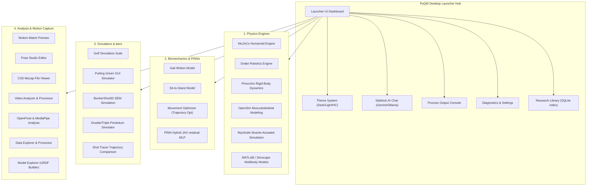
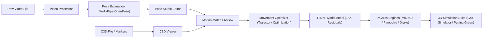

# UpstreamDrift — Project Map & Graphical Repository Guide

> **A premium guide and graphical overview of every feature, module, and integration in the UpstreamDrift biomechanics and simulation platform.**
> Use this document to navigate the launcher tiles, understand engine capabilities, and discover the tools available.

---

## 🗺️ Graphical Architecture Map

The UpstreamDrift repository is organized into five core modules. Below is a graphical representation of the tools available and how they interact:



---

## 🔄 Data & Pipeline Flow

The diagram below maps how data flows from motion capture ingestion and video pose estimation through the optimization pipeline into the 3D physics simulators:



---

## 🛠️ Launcher Reference Guide

### Keyboard Shortcuts

| Category   | Shortcut            | Action                                       |
| :--------- | :------------------ | :------------------------------------------- |
| **Global** | `F1`                | Help dialog                                  |
|            | `Ctrl+?`            | Keyboard shortcuts overlay                   |
|            | `Ctrl+,`            | Preferences and Settings dialog              |
|            | `Ctrl+Q`            | Quit application                             |
| **Grid**   | `Ctrl+=` / `Ctrl+-` | Zoom in / Zoom out tile scale                |
|            | `Double-click`      | Launch selected model tile                   |
|            | `Drag card`         | Reorder tiles (when Layout Lock is unlocked) |

### Condensed Sidebar Categories

The launcher home page sidebar provides instant filtering to help you navigate our extensive toolkit:

> [!TIP]
>
> - **Flexible Labeling**: Tools can belong to multiple categories. For example, the _Movement Optimizer_ will display under both **Biomechanics** and **Tools**.
> - **Favorites**: Click the star `★` icon on any card on hover to add it to your Favorites tab.
> - **History**: The History tab ranks tools dynamically based on your launch frequency (most used) and recency (last launched).

| Sidebar Category  | Icon            | Purpose                                                                |
| :---------------- | :-------------- | :--------------------------------------------------------------------- |
| **Home**          | `home`          | View all available models and tools in a flat grid.                    |
| **Engines**       | `computer`      | High-performance physics simulation backends.                          |
| **Biomechanics**  | `accessibility` | Musculoskeletal models, gait simulations, and trajectory optimization. |
| **Simulation**    | `sports_golf`   | Ball flight physics, green topography, and interactive putters.        |
| **Tools**         | `build`         | Data explorer, video pose processors, and URDF builders.               |
| **Documentation** | `book`          | Guides, project maps, and the document Research Library.               |
| **Favorites**     | `star`          | Quick access to your frequently starred simulation workflows.          |
| **History**       | `history`       | Dynamic list sorted by launch frequency and recency.                   |

---

## 📂 Repository Structure Reference

```
UpstreamDrift/
├── src/
│   ├── launchers/           # PyQt6 launcher application source
│   │   ├── upstream_drift_launcher.py   # Main window and tab manager
│   │   ├── launcher_ui_setup.py         # Home layout & sidebar constructor
│   │   ├── launcher_layout_manager.py   # Tile sorting, filtering & save/load
│   │   ├── model_card.py                # Glassmorphic tile widgets & Favorites star
│   │   ├── library_widget.py            # Document library & NotebookLM interface
│   │   └── startup.py                   # Splash screen & dependency workers
│   ├── config/
│   │   └── models.yaml              # Global model registry mapping
│   ├── engines/
│   │   └── physics_engines/         # MuJoCo, Drake, Pinocchio, MyoSuite integrations
│   ├── shared/
│   │   └── python/
│   │       ├── theme/               # Harmonized design tokens & vector SVGs
│   │       └── ui/                  # Notification toasts, overlays & preferences
│   └── tools/                       # Golf simulation suite, putting green & URDF builders
├── docs/                            # Documentation hub and user manuals
└── tests/                           # Robust test suites for UI, handlers & layout
```

---

## ⚙️ Configuration & Logs

All configurations and run data are persisted in the user's home directory under a secure hidden folder:

| File                   | Path                                              | Description                                                                                          |
| :--------------------- | :------------------------------------------------ | :--------------------------------------------------------------------------------------------------- |
| **Layout & Options**   | `~/.golf_modeling_suite/launcher_layout.json`     | Stores window geometry, view mode, tile scaling, custom order, starred favorites, and history stats. |
| **Library Index**      | `~/.golf_modeling_suite/library/library_index.db` | SQLite database tracking imported documents and extracted metadata.                                  |
| **Application Log**    | `./app_launch.log`                                | Diagnostics log detailing background process triggers and startup status.                            |
| **Subprocess Console** | `~/.golf_modeling_suite/process_output.log`       | Streams stdout/stderr from active simulation processes.                                              |

---

> [!NOTE]
> To get started running simulations, run `python launch_golf_suite.py` from the root of the repository. Ensure your dependencies are installed via `pip install -e ".[dev]"`.
