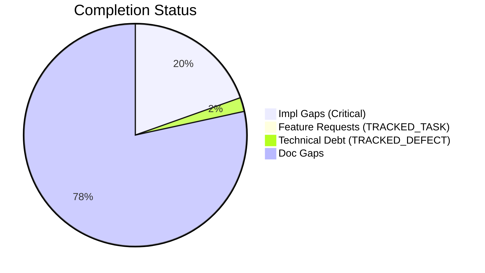
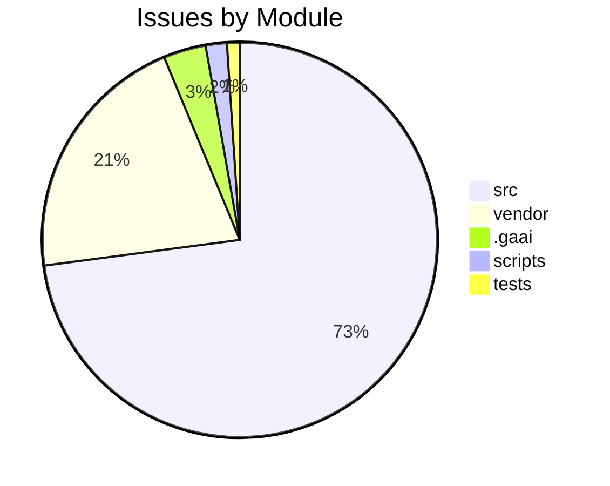

# Completist Report: 2026-04-26

## Executive Summary

- **Critical Gaps**: 260
- **Feature Gaps (TRACKED_TASK)**: 2
- **Technical Debt**: 27
- **Documentation Gaps**: 1043

## Visualization

### Status Overview

### Top Impacted Modules

## Critical Incomplete (Top 50)

| File                                                                                 | Line | Type | Impact | Coverage | Complexity |
| ------------------------------------------------------------------------------------ | ---- | ---- | ------ | -------- | ---------- |
| `./src/api/auth/security.py`                                                         | 335  | Stub | 5      | 2        | 4          |
| `./src/shared/python/physics/_topography_io.py`                                      | 15   | Stub | 5      | 3        | 4          |
| `./src/shared/python/physics/_topography_io.py`                                      | 19   | Stub | 5      | 3        | 4          |
| `./src/shared/python/physics/_topography_io.py`                                      | 21   | Stub | 5      | 3        | 4          |
| `./src/shared/python/physics/_shaft_model.py`                                        | 15   | Stub | 5      | 3        | 4          |
| `./src/shared/python/physics/_shaft_model.py`                                        | 19   | Stub | 5      | 3        | 4          |
| `./src/shared/python/physics/_shaft_model.py`                                        | 23   | Stub | 5      | 3        | 4          |
| `./src/shared/python/physics/_shaft_model.py`                                        | 32   | Stub | 5      | 3        | 4          |
| `./src/shared/python/physics/_shaft_model.py`                                        | 64   | Stub | 5      | 3        | 4          |
| `./src/shared/python/physics/flight_models.py`                                       | 164  | Stub | 5      | 3        | 4          |
| `./src/shared/python/physics/flight_models.py`                                       | 170  | Stub | 5      | 3        | 4          |
| `./src/shared/python/physics/flight_models.py`                                       | 176  | Stub | 5      | 3        | 4          |
| `./src/shared/python/physics/flight_models.py`                                       | 181  | Stub | 5      | 3        | 4          |
| `./src/shared/python/physics/_impact_physics.py`                                     | 117  | Stub | 5      | 3        | 4          |
| `./src/shared/python/physics/impact_model/models.py`                                 | 20   | Stub | 5      | 3        | 4          |
| `./src/shared/python/pendulum_simulator/gui/controls_widget_base.py`                 | 429  | Stub | 5      | 3        | 4          |
| `./src/shared/python/pendulum_simulator/gui/controls_widget_base.py`                 | 439  | Stub | 5      | 3        | 4          |
| `./src/shared/python/pendulum_simulator/gui/controls_widget_base.py`                 | 449  | Stub | 5      | 3        | 4          |
| `./src/shared/python/pendulum_simulator/gui/controls_widget_base.py`                 | 459  | Stub | 5      | 3        | 4          |
| `./src/shared/python/pendulum_simulator/gui/matrix_widget_base.py`                   | 148  | Stub | 5      | 3        | 4          |
| `./src/shared/python/pendulum_simulator/gui/matrix_widget_base.py`                   | 158  | Stub | 5      | 3        | 4          |
| `./src/shared/python/pendulum_simulator/gui/matrix_widget_base.py`                   | 173  | Stub | 5      | 3        | 4          |
| `./src/shared/python/pendulum_simulator/gui/matrix_widget_base.py`                   | 183  | Stub | 5      | 3        | 4          |
| `./src/shared/python/pendulum_simulator/gui/base_pendulum_widget.py`                 | 115  | Stub | 5      | 3        | 4          |
| `./src/shared/python/pendulum_simulator/gui/base_pendulum_widget.py`                 | 120  | Stub | 5      | 3        | 4          |
| `./src/shared/python/pendulum_simulator/gui/base_pendulum_widget.py`                 | 125  | Stub | 5      | 3        | 4          |
| `./src/shared/python/pendulum_simulator/gui/base_pendulum_widget.py`                 | 130  | Stub | 5      | 3        | 4          |
| `./src/shared/python/pendulum_simulator/gui/base_pendulum_widget.py`                 | 135  | Stub | 5      | 3        | 4          |
| `./src/shared/python/model_generation/plugins/__init__.py`                           | 21   | Stub | 5      | 3        | 4          |
| `./src/shared/python/model_generation/plugins/__init__.py`                           | 27   | Stub | 5      | 3        | 4          |
| `./src/shared/python/model_generation/plugins/__init__.py`                           | 32   | Stub | 5      | 3        | 4          |
| `./src/shared/python/model_generation/plugins/__init__.py`                           | 36   | Stub | 5      | 3        | 4          |
| `./src/shared/python/model_generation/library/repository.py`                         | 44   | Stub | 5      | 3        | 4          |
| `./src/shared/python/model_generation/library/repository.py`                         | 50   | Stub | 5      | 3        | 4          |
| `./src/shared/python/model_generation/library/repository.py`                         | 55   | Stub | 5      | 3        | 4          |
| `./src/shared/python/model_generation/library/repository.py`                         | 60   | Stub | 5      | 3        | 4          |
| `./src/shared/python/model_generation/editor/editor_clipboard.py`                    | 41   | Stub | 5      | 3        | 4          |
| `./src/shared/python/model_generation/editor/editor_modifications.py`                | 53   | Stub | 5      | 3        | 4          |
| `./src/shared/python/model_generation/editor/editor_modifications.py`                | 55   | Stub | 5      | 3        | 4          |
| `./src/shared/python/model_generation/editor/editor_modifications.py`                | 57   | Stub | 5      | 3        | 4          |
| `./src/shared/python/model_generation/editor/editor_modifications.py`                | 59   | Stub | 5      | 3        | 4          |
| `./src/shared/python/model_generation/builders/base_builder.py`                      | 197  | Stub | 5      | 3        | 4          |
| `./src/shared/python/model_generation/builders/base_builder.py`                      | 207  | Stub | 5      | 3        | 4          |
| `./src/shared/python/humanoid_character_builder/generators/mesh_generator_models.py` | 59   | Stub | 5      | 3        | 4          |
| `./src/shared/python/humanoid_character_builder/generators/mesh_generator_models.py` | 65   | Stub | 5      | 3        | 4          |
| `./src/shared/python/humanoid_character_builder/generators/mesh_generator_models.py` | 70   | Stub | 5      | 3        | 4          |
| `./src/shared/python/humanoid_character_builder/generators/mesh_generator_models.py` | 90   | Stub | 5      | 3        | 4          |
| `./src/shared/python/humanoid_character_builder/generators/_mesh_types.py`           | 63   | Stub | 5      | 3        | 4          |
| `./src/shared/python/humanoid_character_builder/generators/_mesh_types.py`           | 69   | Stub | 5      | 3        | 4          |
| `./src/shared/python/humanoid_character_builder/generators/_mesh_types.py`           | 74   | Stub | 5      | 3        | 4          |

## Feature Gap Matrix

| Module                                                   | Feature Gap                                               | Type         |
| -------------------------------------------------------- | --------------------------------------------------------- | ------------ |
| `./vendor/ud-tools/src/tools/matlab_quality_utils.py`    | """Check for TODO, FIXME, HACK, XXX, and placeholders.""" | TRACKED_TASK |
| `./vendor/ud-tools/src/tools/matlab_utilities/README.md` | - TODO, FIXME, HACK, XXX placeholders                     | TRACKED_TASK |

## Technical Debt Register

| File                                                                               | Line | Issue                                                                                                | Type |
| ---------------------------------------------------------------------------------- | ---- | ---------------------------------------------------------------------------------------------------- | ---- |
| `./src/api/utils/error_codes.py`                                                   | 53   | # General Errors (GMS-GEN-XXX)                                                                       | XXX  |
| `./src/api/utils/error_codes.py`                                                   | 59   | # Engine Errors (GMS-ENG-XXX)                                                                        | XXX  |
| `./src/api/utils/error_codes.py`                                                   | 67   | # Simulation Errors (GMS-SIM-XXX)                                                                    | XXX  |
| `./src/api/utils/error_codes.py`                                                   | 76   | # Video Errors (GMS-VID-XXX)                                                                         | XXX  |
| `./src/api/utils/error_codes.py`                                                   | 83   | # Analysis Errors (GMS-ANL-XXX)                                                                      | XXX  |
| `./src/api/utils/error_codes.py`                                                   | 88   | # Auth Errors (GMS-AUT-XXX)                                                                          | XXX  |
| `./src/api/utils/error_codes.py`                                                   | 95   | # Validation Errors (GMS-VAL-XXX)                                                                    | XXX  |
| `./src/api/utils/error_codes.py`                                                   | 101  | # Resource Errors (GMS-RES-XXX)                                                                      | XXX  |
| `./src/api/utils/error_codes.py`                                                   | 106  | # System Errors (GMS-SYS-XXX)                                                                        | XXX  |
| `./src/shared/models/opensim/opensim-models/Tutorials/doc/styles/site.css`         | 3404 | html body { /_ HACK: Temporary fix for CONF-15412 _/                                                 | HACK |
| `./src/engines/pendulum_models/tools/matlab_utilities/README.md`                   | 261  | - TRACKED_TASK, TRACKED_DEFECT, HACK, XXX placeholders                                               | XXX  |
| `./src/engines/physics_engines/drake/tools/matlab_utilities/README.md`             | 261  | - TRACKED_TASK, TRACKED_DEFECT, HACK, XXX placeholders                                               | XXX  |
| `./src/engines/physics_engines/pinocchio/tools/matlab_utilities/README.md`         | 261  | - TRACKED_TASK, TRACKED_DEFECT, HACK, XXX placeholders                                               | XXX  |
| `./src/engines/Simscape_Multibody_Models/3D_Golf_Model/matlab_utilities/README.md` | 261  | - TRACKED_TASK, TRACKED_DEFECT, HACK, XXX placeholders                                               | XXX  |
| `./src/tools/matlab_utilities/scripts/matlab_quality_check.py`                     | 89   | (r"\bHACK\b", "HACK comment found"),                                                                 | HACK |
| `./src/tools/matlab_utilities/scripts/matlab_quality_check.py`                     | 90   | (r"\bXXX\b", "XXX comment found"),                                                                   | XXX  |
| `./shared/models/opensim/opensim-models/Tutorials/doc/styles/site.css`             | 3404 | html body { /_ HACK: Temporary fix for CONF-15412 _/                                                 | HACK |
| `./scripts/refresh_completist_data.py`                                             | 60   | "TRACKED_TASK\|TRACKED_DEFECT\|XXX\|HACK\|TEMP",                                                     | XXX  |
| `./vendor/ud-tools/src/tools/matlab_quality_utils.py`                              | 321  | (r"\bHACK\b", "HACK comment found"),                                                                 | HACK |
| `./vendor/ud-tools/src/tools/matlab_quality_utils.py`                              | 322  | (r"\bXXX\b", "XXX comment found"),                                                                   | XXX  |
| `./.gaai/core/skills/cross/friction-retrospective/SKILL.md`                        | 58   | - `signal: high` → automatic promotion candidate (CAND-XXX)                                          | XXX  |
| `./.gaai/core/skills/cross/friction-retrospective/SKILL.md`                        | 64   | - **High-Signal Events (CAND-XXX):** each candidate with evidence, proposed promotion target, and re | XXX  |
| `./.gaai/core/skills/cross/friction-retrospective/SKILL.md`                        | 91   | - Promotion candidates (CAND-XXX) with evidence and recommended targets                              | XXX  |
| `./.gaai/core/skills/cross/friction-retrospective/SKILL.md`                        | 98   | - Every CAND-XXX has at least 2 supporting evidence entries (or 1 with `signal: high`)               | XXX  |
| `./tests/unit/api/test_error_codes.py`                                             | 36   | """Postcondition: All codes follow GMS-XXX-NNN format."""                                            | XXX  |
| `./tests/unit/utils/test_error_codes.py`                                           | 39   | """Every error code must follow GMS-XXX-NNN pattern."""                                              | XXX  |
| `./tests/unit/utils/test_error_codes.py`                                           | 42   | assert len(parts) == 3, f"{code.name} doesn't follow GMS-XXX-NNN"                                    | XXX  |

## Recommended Implementation Order

Prioritized by Impact (High) and Complexity (Low).
| Priority | File | Issue | Metrics (I/C/C) |
|---|---|---|---|
| 1 | `./src/api/auth/security.py` | **init** | 5/2/4 |
| 2 | `./src/shared/python/physics/_topography_io.py` | set_heightmap | 5/3/4 |
| 3 | `./src/shared/python/physics/_topography_io.py` | set_contour_points | 5/3/4 |
| 4 | `./src/shared/python/physics/_topography_io.py` | to_heightmap | 5/3/4 |
| 5 | `./src/shared/python/physics/_shaft_model.py` | initialize | 5/3/4 |
| 6 | `./src/shared/python/physics/_shaft_model.py` | get_state | 5/3/4 |
| 7 | `./src/shared/python/physics/_shaft_model.py` | apply_load | 5/3/4 |
| 8 | `./src/shared/python/physics/_shaft_model.py` | step | 5/3/4 |
| 9 | `./src/shared/python/physics/_shaft_model.py` | apply_load | 5/3/4 |
| 10 | `./src/shared/python/physics/flight_models.py` | name | 5/3/4 |
| 11 | `./src/shared/python/physics/flight_models.py` | description | 5/3/4 |
| 12 | `./src/shared/python/physics/flight_models.py` | reference | 5/3/4 |
| 13 | `./src/shared/python/physics/flight_models.py` | simulate | 5/3/4 |
| 14 | `./src/shared/python/physics/_impact_physics.py` | solve | 5/3/4 |
| 15 | `./src/shared/python/physics/impact_model/models.py` | solve | 5/3/4 |
| 16 | `./src/shared/python/pendulum_simulator/gui/controls_widget_base.py` | \_apply_preset | 5/3/4 |
| 17 | `./src/shared/python/pendulum_simulator/gui/controls_widget_base.py` | get_params | 5/3/4 |
| 18 | `./src/shared/python/pendulum_simulator/gui/controls_widget_base.py` | \_get_joint_names | 5/3/4 |
| 19 | `./src/shared/python/pendulum_simulator/gui/controls_widget_base.py` | \_get_torque_inputs | 5/3/4 |
| 20 | `./src/shared/python/pendulum_simulator/gui/matrix_widget_base.py` | get_matrix_size | 5/3/4 |

## Issues Created

- Created `docs/assessments/issues/Issue_2409_Incomplete_Stub_in_security_py_335.md`
- Created `docs/assessments/issues/Issue_2410_Incomplete_Stub_in__topography_io_py_15.md`
- Created `docs/assessments/issues/Issue_2411_Incomplete_Stub_in__topography_io_py_19.md`
- Created `docs/assessments/issues/Issue_2412_Incomplete_Stub_in__topography_io_py_21.md`
- Created `docs/assessments/issues/Issue_2413_Incomplete_Stub_in__shaft_model_py_15.md`
- Created `docs/assessments/issues/Issue_2414_Incomplete_Stub_in__shaft_model_py_19.md`
- Created `docs/assessments/issues/Issue_2415_Incomplete_Stub_in__shaft_model_py_23.md`
- Created `docs/assessments/issues/Issue_2416_Incomplete_Stub_in__shaft_model_py_32.md`
- Created `docs/assessments/issues/Issue_2417_Incomplete_Stub_in__shaft_model_py_64.md`
- Created `docs/assessments/issues/Issue_2204_Incomplete_Stub_in_flight_models_py_164.md`
- Created `docs/assessments/issues/Issue_2205_Incomplete_Stub_in_flight_models_py_170.md`
- Created `docs/assessments/issues/Issue_2206_Incomplete_Stub_in_flight_models_py_176.md`
- Created `docs/assessments/issues/Issue_2207_Incomplete_Stub_in_flight_models_py_181.md`
- Created `docs/assessments/issues/Issue_2422_Incomplete_Stub_in__impact_physics_py_117.md`
- Created `docs/assessments/issues/Issue_2299_Incomplete_Stub_in_models_py_20.md`
- Created `docs/assessments/issues/Issue_2306_Incomplete_Stub_in_controls_widget_base_py_429.md`
- Created `docs/assessments/issues/Issue_2307_Incomplete_Stub_in_controls_widget_base_py_439.md`
- Created `docs/assessments/issues/Issue_2308_Incomplete_Stub_in_controls_widget_base_py_449.md`
- Created `docs/assessments/issues/Issue_2309_Incomplete_Stub_in_controls_widget_base_py_459.md`
- Created `docs/assessments/issues/Issue_2221_Incomplete_Stub_in_matrix_widget_base_py_148.md`
- Created `docs/assessments/issues/Issue_2222_Incomplete_Stub_in_matrix_widget_base_py_158.md`
- Created `docs/assessments/issues/Issue_2223_Incomplete_Stub_in_matrix_widget_base_py_173.md`
- Created `docs/assessments/issues/Issue_2224_Incomplete_Stub_in_matrix_widget_base_py_183.md`
- Created `docs/assessments/issues/Issue_2225_Incomplete_Stub_in_base_pendulum_widget_py_115.md`
- Created `docs/assessments/issues/Issue_2226_Incomplete_Stub_in_base_pendulum_widget_py_120.md`
- Created `docs/assessments/issues/Issue_2227_Incomplete_Stub_in_base_pendulum_widget_py_125.md`
- Created `docs/assessments/issues/Issue_2228_Incomplete_Stub_in_base_pendulum_widget_py_130.md`
- Created `docs/assessments/issues/Issue_2229_Incomplete_Stub_in_base_pendulum_widget_py_135.md`
- Created `docs/assessments/issues/Issue_2062_Incomplete_Stub_in___init___py_21.md`
- Created `docs/assessments/issues/Issue_2063_Incomplete_Stub_in___init___py_27.md`
- Created `docs/assessments/issues/Issue_2064_Incomplete_Stub_in___init___py_32.md`
- Created `docs/assessments/issues/Issue_2065_Incomplete_Stub_in___init___py_36.md`
- Created `docs/assessments/issues/Issue_2066_Incomplete_Stub_in_repository_py_44.md`
- Created `docs/assessments/issues/Issue_2067_Incomplete_Stub_in_repository_py_50.md`
- Created `docs/assessments/issues/Issue_2068_Incomplete_Stub_in_repository_py_55.md`
- Created `docs/assessments/issues/Issue_2069_Incomplete_Stub_in_repository_py_60.md`
- Created `docs/assessments/issues/Issue_2070_Incomplete_Stub_in_editor_clipboard_py_41.md`
- Created `docs/assessments/issues/Issue_2073_Incomplete_Stub_in_editor_modifications_py_53.md`
- Created `docs/assessments/issues/Issue_2074_Incomplete_Stub_in_editor_modifications_py_55.md`
- Created `docs/assessments/issues/Issue_2241_Incomplete_Stub_in_editor_modifications_py_57.md`
- Created `docs/assessments/issues/Issue_2242_Incomplete_Stub_in_editor_modifications_py_59.md`
- Created `docs/assessments/issues/Issue_2243_Incomplete_Stub_in_base_builder_py_197.md`
- Created `docs/assessments/issues/Issue_2451_Incomplete_Stub_in_base_builder_py_207.md`
- Created `docs/assessments/issues/Issue_2349_Incomplete_Stub_in_mesh_generator_models_py_59.md`
- Created `docs/assessments/issues/Issue_2350_Incomplete_Stub_in_mesh_generator_models_py_65.md`
- Created `docs/assessments/issues/Issue_2351_Incomplete_Stub_in_mesh_generator_models_py_70.md`
- Created `docs/assessments/issues/Issue_2352_Incomplete_Stub_in_mesh_generator_models_py_90.md`
- Created `docs/assessments/issues/Issue_2456_Incomplete_Stub_in__mesh_types_py_63.md`
- Created `docs/assessments/issues/Issue_2457_Incomplete_Stub_in__mesh_types_py_69.md`
- Created `docs/assessments/issues/Issue_2458_Incomplete_Stub_in__mesh_types_py_74.md`
