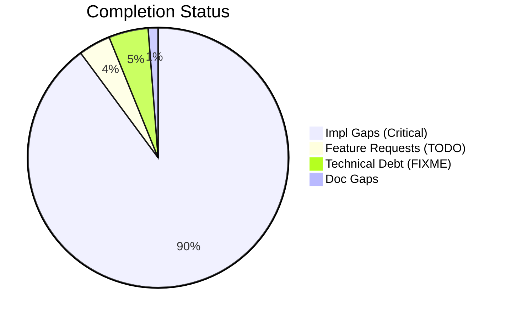
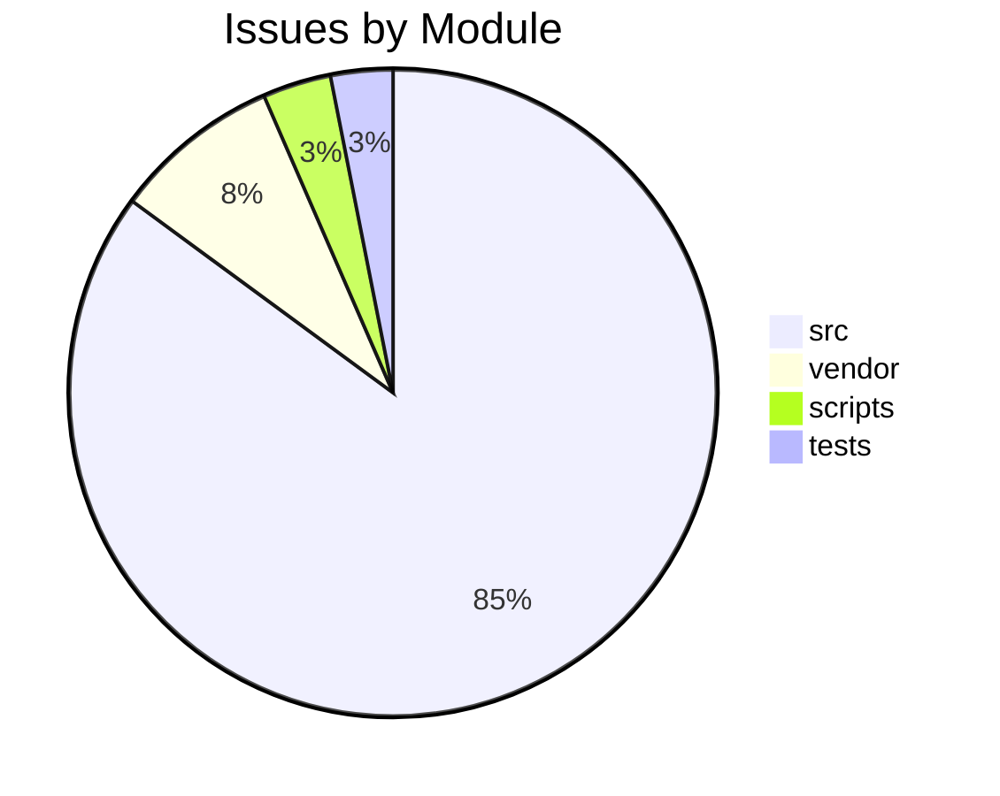

# Completist Report: 2026-03-05

## Executive Summary
- **Critical Gaps**: 293
- **Feature Gaps (TODO)**: 13
- **Technical Debt**: 16
- **Documentation Gaps**: 4

## Visualization
### Status Overview

### Top Impacted Modules

## Critical Incomplete (Top 50)
| File | Line | Type | Impact | Coverage | Complexity |
|---|---|---|---|---|---|
| `./vendor/ud-tools/src/shared/python/model_generation/library/repository.py` | 40 | Stub | 5 | 3 | 4 |
| `./vendor/ud-tools/src/shared/python/model_generation/library/repository.py` | 46 | Stub | 5 | 3 | 4 |
| `./vendor/ud-tools/src/shared/python/model_generation/library/repository.py` | 51 | Stub | 5 | 3 | 4 |
| `./vendor/ud-tools/src/shared/python/model_generation/library/repository.py` | 56 | Stub | 5 | 3 | 4 |
| `./vendor/ud-tools/src/shared/python/model_generation/builders/base_builder.py` | 183 | Stub | 5 | 3 | 4 |
| `./vendor/ud-tools/src/shared/python/model_generation/builders/base_builder.py` | 193 | Stub | 5 | 3 | 4 |
| `./vendor/ud-tools/src/shared/python/model_generation/plugins/__init__.py` | 21 | Stub | 5 | 3 | 4 |
| `./vendor/ud-tools/src/shared/python/model_generation/plugins/__init__.py` | 27 | Stub | 5 | 3 | 4 |
| `./vendor/ud-tools/src/shared/python/model_generation/plugins/__init__.py` | 32 | Stub | 5 | 3 | 4 |
| `./vendor/ud-tools/src/shared/python/model_generation/plugins/__init__.py` | 36 | Stub | 5 | 3 | 4 |
| `./vendor/ud-tools/src/shared/python/upstream_drift_tools/process_calculators/acid_gas_dewpoint_calculator.py` | 713 | Stub | 5 | 3 | 4 |
| `./vendor/ud-tools/src/shared/python/upstream_drift_tools/process_calculators/acid_gas_dewpoint_calculator.py` | 716 | Stub | 5 | 3 | 4 |
| `./vendor/ud-tools/src/shared/python/upstream_drift_tools/process_calculators/acid_gas_dewpoint_calculator.py` | 863 | Stub | 5 | 3 | 4 |
| `./vendor/ud-tools/src/shared/python/upstream_drift_tools/process_calculators/acid_gas_dewpoint_calculator.py` | 866 | Stub | 5 | 3 | 4 |
| `./vendor/ud-tools/src/shared/python/upstream_drift_tools/process_calculators/pressure_drop_calculator/__init__.py` | 221 | Stub | 5 | 3 | 4 |
| `./vendor/ud-tools/src/shared/python/upstream_drift_tools/process_calculators/psa_package/psa_gui.py` | 156 | Stub | 5 | 3 | 4 |
| `./vendor/ud-tools/src/shared/python/upstream_drift_tools/ui/mixins/calculator_state_mixin.py` | 428 | Stub | 5 | 3 | 4 |
| `./vendor/ud-tools/src/shared/python/humanoid_character_builder/generators/mesh_generator.py` | 68 | Stub | 5 | 3 | 4 |
| `./vendor/ud-tools/src/shared/python/humanoid_character_builder/generators/mesh_generator.py` | 74 | Stub | 5 | 3 | 4 |
| `./vendor/ud-tools/src/shared/python/humanoid_character_builder/generators/mesh_generator.py` | 79 | Stub | 5 | 3 | 4 |
| `./vendor/ud-tools/src/shared/python/humanoid_character_builder/generators/mesh_generator.py` | 99 | Stub | 5 | 3 | 4 |
| `./src/engines/common/simulation_control.py` | 188 | Stub | 5 | 2 | 4 |
| `./src/engines/common/simulation_control.py` | 194 | Stub | 5 | 2 | 4 |
| `./src/engines/common/simulation_control.py` | 206 | Stub | 5 | 2 | 4 |
| `./src/engines/common/simulation_control.py` | 240 | Stub | 5 | 2 | 4 |
| `./src/engines/common/simulation_control.py` | 252 | Stub | 5 | 2 | 4 |
| `./src/engines/common/physics.py` | 482 | Stub | 5 | 2 | 4 |
| `./src/engines/common/physics.py` | 486 | Stub | 5 | 2 | 4 |
| `./src/engines/common/physics.py` | 490 | Stub | 5 | 2 | 4 |
| `./src/engines/common/export.py` | 71 | Stub | 5 | 2 | 4 |
| `./src/engines/common/export.py` | 83 | Stub | 5 | 2 | 4 |
| `./src/engines/common/export.py` | 97 | Stub | 5 | 2 | 4 |
| `./src/engines/common/export.py` | 106 | Stub | 5 | 2 | 4 |
| `./src/engines/common/export.py` | 111 | Stub | 5 | 2 | 4 |
| `./src/engines/Simscape_Multibody_Models/3D_Golf_Model/matlab/src/apps/golf_gui/Simscape Multibody Data Plotters/Python Version/golf_gui_r0/golf_visualizer_implementation.py` | 558 | Stub | 5 | 2 | 4 |
| `./src/engines/Simscape_Multibody_Models/3D_Golf_Model/matlab/src/apps/golf_gui/Simscape Multibody Data Plotters/Python Version/golf_gui_r0/golf_visualizer_implementation.py` | 852 | Stub | 5 | 2 | 4 |
| `./src/engines/Simscape_Multibody_Models/3D_Golf_Model/matlab/src/apps/golf_gui/Simscape Multibody Data Plotters/Python Version/integrated_golf_gui_r0/golf_playback_controller.py` | 269 | Stub | 5 | 2 | 4 |
| `./src/engines/physics_engines/pendulum/python/pendulum_physics_engine.py` | 79 | Stub | 5 | 2 | 4 |
| `./src/engines/physics_engines/pendulum/python/pendulum_physics_engine.py` | 82 | Stub | 5 | 2 | 4 |
| `./src/engines/physics_engines/pendulum/python/pendulum_physics_engine.py` | 128 | Stub | 5 | 2 | 4 |
| `./src/engines/physics_engines/pinocchio/python/pinocchio_golf/gui.py` | 312 | Stub | 5 | 2 | 4 |
| `./src/engines/physics_engines/drake/python/src/drake_gui_app.py` | 358 | Stub | 5 | 2 | 4 |
| `./src/engines/physics_engines/mujoco/docker/gui/golf_gui_docker.py` | 39 | Stub | 5 | 2 | 4 |
| `./src/engines/physics_engines/mujoco/docker/gui/golf_gui_docker.py` | 40 | Stub | 5 | 2 | 4 |
| `./src/engines/physics_engines/mujoco/python/humanoid_launcher_analysis.py` | 297 | Stub | 5 | 2 | 4 |
| `./src/engines/physics_engines/mujoco/python/mujoco_humanoid_golf/pinocchio_interface.py` | 154 | Stub | 5 | 2 | 4 |
| `./src/engines/physics_engines/mujoco/python/mujoco_humanoid_golf/examples_chaotic_pendulum.py` | 71 | Stub | 5 | 2 | 4 |
| `./src/engines/physics_engines/mujoco/python/mujoco_humanoid_golf/examples_chaotic_pendulum.py` | 75 | Stub | 5 | 2 | 4 |
| `./src/engines/physics_engines/mujoco/python/mujoco_humanoid_golf/urdf_io.py` | 514 | Stub | 5 | 2 | 4 |
| `./src/engines/physics_engines/mujoco/python/mujoco_humanoid_golf/gui/core/main_window.py` | 465 | Stub | 5 | 2 | 4 |

## Feature Gap Matrix
| Module | Feature Gap | Type |
|---|---|---|
| `./tests/tools/test_code_quality_check.py` | lines = ["# TODO: fix this", "def test():", "    ...  ", "    pass"] | TODO |
| `./tests/tools/test_code_quality_check.py` | assert any("TODO placeholder" in t for t in types) | TODO |
| `./tests/tools/test_code_quality_check.py` | lines = ["# TODO: internal marker"] | TODO |
| `./tests/tools/test_code_quality_check.py` | f.write_text("# TODO: fix this\n") | TODO |
| `./tests/tools/test_code_quality_check.py` | assert any("TODO" in i[1] for i in issues) | TODO |
| `./scripts/pragmatic_programmer_review.py` | """Report high TODO counts as a technical debt indicator.""" | TODO |
| `./scripts/pragmatic_programmer_review.py` | if "TODO" in content: | TODO |
| `./scripts/pragmatic_programmer_review.py` | "title": f"High TODO count ({len(todos)})", | TODO |
| `./scripts/generate_todo_fixme_register.py` | ["rg", "-n", "TODO\|FIXME", "src", "tests", "scripts"], | TODO |
| `./scripts/generate_todo_fixme_register.py` | "# TODO/FIXME Debt Register", | TODO |
| `./scripts/generate_todo_fixme_register.py` | "This register is generated from inline TODO/FIXME markers.", | TODO |
| `./scripts/generate_todo_fixme_register.py` | marker = "TODO" if "TODO" in text else "FIXME" | TODO |
| `./scripts/refresh_completist_data.py` | "TODO\|FIXME\|XXX\|HACK\|TEMP", | TODO |

## Technical Debt Register
| File | Line | Issue | Type |
|---|---|---|---|
| `./tests/unit/utils/test_error_codes.py` | 39 | """Every error code must follow GMS-XXX-NNN pattern.""" | XXX |
| `./tests/unit/utils/test_error_codes.py` | 42 | assert len(parts) == 3, f"{code.name} doesn't follow GMS-XXX-NNN" | XXX |
| `./tests/unit/api/test_error_codes.py` | 36 | """Postcondition: All codes follow GMS-XXX-NNN format.""" | XXX |
| `./tests/tools/test_code_quality_check.py` | 83 | lines = ["# FIXME: broken logic"] | FIXME |
| `./tests/tools/test_code_quality_check.py` | 85 | assert any("FIXME" in i[1] for i in issues) | FIXME |
| `./src/api/utils/error_codes.py` | 53 | # General Errors (GMS-GEN-XXX) | XXX |
| `./src/api/utils/error_codes.py` | 59 | # Engine Errors (GMS-ENG-XXX) | XXX |
| `./src/api/utils/error_codes.py` | 67 | # Simulation Errors (GMS-SIM-XXX) | XXX |
| `./src/api/utils/error_codes.py` | 76 | # Video Errors (GMS-VID-XXX) | XXX |
| `./src/api/utils/error_codes.py` | 83 | # Analysis Errors (GMS-ANL-XXX) | XXX |
| `./src/api/utils/error_codes.py` | 88 | # Auth Errors (GMS-AUT-XXX) | XXX |
| `./src/api/utils/error_codes.py` | 95 | # Validation Errors (GMS-VAL-XXX) | XXX |
| `./src/api/utils/error_codes.py` | 101 | # Resource Errors (GMS-RES-XXX) | XXX |
| `./src/api/utils/error_codes.py` | 106 | # System Errors (GMS-SYS-XXX) | XXX |
| `./src/tools/matlab_utilities/scripts/matlab_quality_check.py` | 77 | (r"\bHACK\b", "HACK comment found"), | HACK |
| `./src/tools/matlab_utilities/scripts/matlab_quality_check.py` | 78 | (r"\bXXX\b", "XXX comment found"), | XXX |

## Recommended Implementation Order
Prioritized by Impact (High) and Complexity (Low).
| Priority | File | Issue | Metrics (I/C/C) |
|---|---|---|---|
| 1 | `./vendor/ud-tools/src/shared/python/model_generation/library/repository.py` | name | 5/3/4 |
| 2 | `./vendor/ud-tools/src/shared/python/model_generation/library/repository.py` | description | 5/3/4 |
| 3 | `./vendor/ud-tools/src/shared/python/model_generation/library/repository.py` | list_models | 5/3/4 |
| 4 | `./vendor/ud-tools/src/shared/python/model_generation/library/repository.py` | download_model | 5/3/4 |
| 5 | `./vendor/ud-tools/src/shared/python/model_generation/builders/base_builder.py` | build | 5/3/4 |
| 6 | `./vendor/ud-tools/src/shared/python/model_generation/builders/base_builder.py` | clear | 5/3/4 |
| 7 | `./vendor/ud-tools/src/shared/python/model_generation/plugins/__init__.py` | name | 5/3/4 |
| 8 | `./vendor/ud-tools/src/shared/python/model_generation/plugins/__init__.py` | version | 5/3/4 |
| 9 | `./vendor/ud-tools/src/shared/python/model_generation/plugins/__init__.py` | initialize | 5/3/4 |
| 10 | `./vendor/ud-tools/src/shared/python/model_generation/plugins/__init__.py` | shutdown | 5/3/4 |
| 11 | `./vendor/ud-tools/src/shared/python/upstream_drift_tools/process_calculators/acid_gas_dewpoint_calculator.py` | setup_connections | 5/3/4 |
| 12 | `./vendor/ud-tools/src/shared/python/upstream_drift_tools/process_calculators/acid_gas_dewpoint_calculator.py` | set_default_values | 5/3/4 |
| 13 | `./vendor/ud-tools/src/shared/python/upstream_drift_tools/process_calculators/acid_gas_dewpoint_calculator.py` | set_default_values | 5/3/4 |
| 14 | `./vendor/ud-tools/src/shared/python/upstream_drift_tools/process_calculators/acid_gas_dewpoint_calculator.py` | setup_connections | 5/3/4 |
| 15 | `./vendor/ud-tools/src/shared/python/upstream_drift_tools/process_calculators/pressure_drop_calculator/__init__.py` | __init__ | 5/3/4 |
| 16 | `./vendor/ud-tools/src/shared/python/upstream_drift_tools/process_calculators/psa_package/psa_gui.py` | _on_input_change | 5/3/4 |
| 17 | `./vendor/ud-tools/src/shared/python/upstream_drift_tools/ui/mixins/calculator_state_mixin.py` | set_calculator_specific_state | 5/3/4 |
| 18 | `./vendor/ud-tools/src/shared/python/humanoid_character_builder/generators/mesh_generator.py` | backend_name | 5/3/4 |
| 19 | `./vendor/ud-tools/src/shared/python/humanoid_character_builder/generators/mesh_generator.py` | is_available | 5/3/4 |
| 20 | `./vendor/ud-tools/src/shared/python/humanoid_character_builder/generators/mesh_generator.py` | generate | 5/3/4 |

## Issues Created
- Created `docs/assessments/issues/Issue_049_Incomplete_Stub_in_repository_py_40.md`
- Created `docs/assessments/issues/Issue_050_Incomplete_Stub_in_repository_py_46.md`
- Created `docs/assessments/issues/Issue_051_Incomplete_Stub_in_repository_py_51.md`
- Created `docs/assessments/issues/Issue_052_Incomplete_Stub_in_repository_py_56.md`
- Created `docs/assessments/issues/Issue_053_Incomplete_Stub_in_base_builder_py_183.md`
- Created `docs/assessments/issues/Issue_054_Incomplete_Stub_in_base_builder_py_193.md`
- Created `docs/assessments/issues/Issue_055_Incomplete_Stub_in___init___py_21.md`
- Created `docs/assessments/issues/Issue_056_Incomplete_Stub_in___init___py_27.md`
- Created `docs/assessments/issues/Issue_057_Incomplete_Stub_in___init___py_32.md`
- Created `docs/assessments/issues/Issue_058_Incomplete_Stub_in___init___py_36.md`
- Created `docs/assessments/issues/Issue_069_Incomplete_Stub_in_acid_gas_dewpoint_calculator_py_713.md`
- Created `docs/assessments/issues/Issue_070_Incomplete_Stub_in_acid_gas_dewpoint_calculator_py_716.md`
- Created `docs/assessments/issues/Issue_071_Incomplete_Stub_in_acid_gas_dewpoint_calculator_py_863.md`
- Created `docs/assessments/issues/Issue_072_Incomplete_Stub_in_acid_gas_dewpoint_calculator_py_866.md`
- Created `docs/assessments/issues/Issue_073_Incomplete_Stub_in___init___py_221.md`
- Created `docs/assessments/issues/Issue_074_Incomplete_Stub_in_psa_gui_py_156.md`
- Created `docs/assessments/issues/Issue_075_Incomplete_Stub_in_calculator_state_mixin_py_428.md`
- Created `docs/assessments/issues/Issue_076_Incomplete_Stub_in_mesh_generator_py_68.md`
- Created `docs/assessments/issues/Issue_077_Incomplete_Stub_in_mesh_generator_py_74.md`
- Created `docs/assessments/issues/Issue_078_Incomplete_Stub_in_mesh_generator_py_79.md`
- Created `docs/assessments/issues/Issue_079_Incomplete_Stub_in_mesh_generator_py_99.md`
- Created `docs/assessments/issues/Issue_2048_Incomplete_Stub_in_simulation_control_py_188.md`
- Created `docs/assessments/issues/Issue_2049_Incomplete_Stub_in_simulation_control_py_194.md`
- Created `docs/assessments/issues/Issue_2050_Incomplete_Stub_in_simulation_control_py_206.md`
- Created `docs/assessments/issues/Issue_2051_Incomplete_Stub_in_simulation_control_py_240.md`
- Created `docs/assessments/issues/Issue_2052_Incomplete_Stub_in_simulation_control_py_252.md`
- Created `docs/assessments/issues/Issue_2099_Incomplete_Stub_in_physics_py_482.md`
- Created `docs/assessments/issues/Issue_2100_Incomplete_Stub_in_physics_py_486.md`
- Created `docs/assessments/issues/Issue_2101_Incomplete_Stub_in_physics_py_490.md`
- Created `docs/assessments/issues/Issue_2102_Incomplete_Stub_in_export_py_71.md`
- Created `docs/assessments/issues/Issue_2103_Incomplete_Stub_in_export_py_83.md`
- Created `docs/assessments/issues/Issue_2104_Incomplete_Stub_in_export_py_97.md`
- Created `docs/assessments/issues/Issue_2105_Incomplete_Stub_in_export_py_106.md`
- Created `docs/assessments/issues/Issue_2106_Incomplete_Stub_in_export_py_111.md`
- Created `docs/assessments/issues/Issue_2107_Incomplete_Stub_in_golf_visualizer_implementation_py_558.md`
- Created `docs/assessments/issues/Issue_2108_Incomplete_Stub_in_golf_visualizer_implementation_py_852.md`
- Created `docs/assessments/issues/Issue_2109_Incomplete_Stub_in_golf_playback_controller_py_269.md`
- Created `docs/assessments/issues/Issue_2110_Incomplete_Stub_in_pendulum_physics_engine_py_79.md`
- Created `docs/assessments/issues/Issue_2111_Incomplete_Stub_in_pendulum_physics_engine_py_82.md`
- Created `docs/assessments/issues/Issue_2112_Incomplete_Stub_in_pendulum_physics_engine_py_128.md`
- Created `docs/assessments/issues/Issue_2113_Incomplete_Stub_in_gui_py_312.md`
- Created `docs/assessments/issues/Issue_2114_Incomplete_Stub_in_drake_gui_app_py_358.md`
- Created `docs/assessments/issues/Issue_2115_Incomplete_Stub_in_golf_gui_docker_py_39.md`
- Created `docs/assessments/issues/Issue_2116_Incomplete_Stub_in_golf_gui_docker_py_40.md`
- Created `docs/assessments/issues/Issue_2117_Incomplete_Stub_in_humanoid_launcher_analysis_py_297.md`
- Created `docs/assessments/issues/Issue_093_Incomplete_Stub_in_pinocchio_interface_py_154.md`
- Created `docs/assessments/issues/Issue_094_Incomplete_Stub_in_examples_chaotic_pendulum_py_71.md`
- Created `docs/assessments/issues/Issue_095_Incomplete_Stub_in_examples_chaotic_pendulum_py_75.md`
- Created `docs/assessments/issues/Issue_096_Incomplete_Stub_in_urdf_io_py_514.md`
- Created `docs/assessments/issues/Issue_2122_Incomplete_Stub_in_main_window_py_465.md`