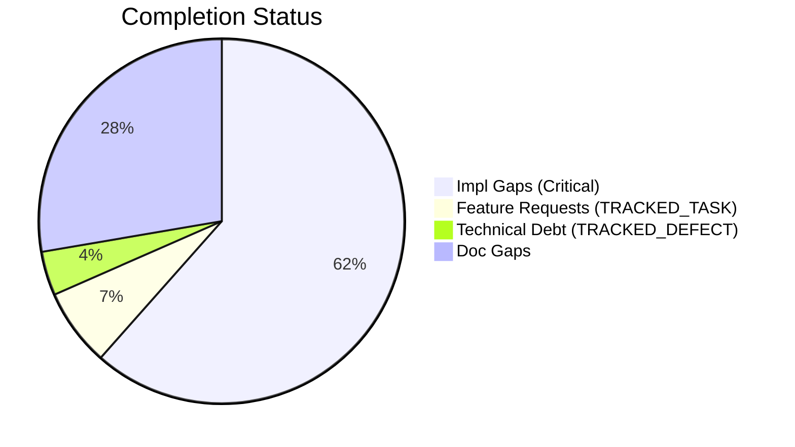
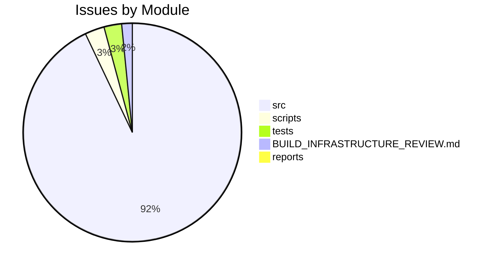

# Completist Report: 2026-03-09

## Executive Summary

- **Critical Gaps**: 331
- **Feature Gaps (TRACKED_TASK)**: 37
- **Technical Debt**: 21
- **Documentation Gaps**: 149

## Visualization

### Status Overview

### Top Impacted Modules

## Critical Incomplete (Top 50)

| File                                                                                                                                                                                | Line | Type | Impact | Coverage | Complexity |
| ----------------------------------------------------------------------------------------------------------------------------------------------------------------------------------- | ---- | ---- | ------ | -------- | ---------- |
| `./src/engines/Simscape_Multibody_Models/3D_Golf_Model/matlab/src/apps/golf_gui/Simscape Multibody Data Plotters/Python Version/golf_gui_r0/golf_visualizer_implementation.py`      | 558  | Stub | 5      | 2        | 4          |
| `./src/engines/Simscape_Multibody_Models/3D_Golf_Model/matlab/src/apps/golf_gui/Simscape Multibody Data Plotters/Python Version/golf_gui_r0/golf_visualizer_implementation.py`      | 852  | Stub | 5      | 2        | 4          |
| `./src/engines/Simscape_Multibody_Models/3D_Golf_Model/matlab/src/apps/golf_gui/Simscape Multibody Data Plotters/Python Version/integrated_golf_gui_r0/golf_playback_controller.py` | 269  | Stub | 5      | 2        | 4          |
| `./src/engines/physics_engines/drake/python/src/drake_gui_app.py`                                                                                                                   | 358  | Stub | 5      | 2        | 4          |
| `./src/engines/physics_engines/mujoco/python/humanoid_launcher_analysis.py`                                                                                                         | 297  | Stub | 5      | 2        | 4          |
| `./src/engines/physics_engines/mujoco/python/mujoco_humanoid_golf/pinocchio_interface.py`                                                                                           | 154  | Stub | 5      | 2        | 4          |
| `./src/engines/physics_engines/mujoco/python/mujoco_humanoid_golf/examples_chaotic_pendulum.py`                                                                                     | 71   | Stub | 5      | 2        | 4          |
| `./src/engines/physics_engines/mujoco/python/mujoco_humanoid_golf/examples_chaotic_pendulum.py`                                                                                     | 75   | Stub | 5      | 2        | 4          |
| `./src/engines/physics_engines/mujoco/python/mujoco_humanoid_golf/urdf_io.py`                                                                                                       | 514  | Stub | 5      | 2        | 4          |
| `./src/engines/physics_engines/mujoco/python/mujoco_humanoid_golf/gui/core/main_window.py`                                                                                          | 465  | Stub | 5      | 2        | 4          |
| `./src/engines/physics_engines/mujoco/docker/gui/golf_gui_docker.py`                                                                                                                | 39   | Stub | 5      | 2        | 4          |
| `./src/engines/physics_engines/mujoco/docker/gui/golf_gui_docker.py`                                                                                                                | 40   | Stub | 5      | 2        | 4          |
| `./src/engines/physics_engines/pendulum/python/golf_swing_physics_engine.py`                                                                                                        | 171  | Stub | 5      | 2        | 4          |
| `./src/engines/physics_engines/pendulum/python/golf_swing_physics_engine.py`                                                                                                        | 174  | Stub | 5      | 2        | 4          |
| `./src/engines/physics_engines/pendulum/python/golf_swing_physics_engine.py`                                                                                                        | 265  | Stub | 5      | 2        | 4          |
| `./src/engines/physics_engines/pendulum/python/pendulum_physics_engine.py`                                                                                                          | 79   | Stub | 5      | 2        | 4          |
| `./src/engines/physics_engines/pendulum/python/pendulum_physics_engine.py`                                                                                                          | 82   | Stub | 5      | 2        | 4          |
| `./src/engines/physics_engines/pendulum/python/pendulum_physics_engine.py`                                                                                                          | 128  | Stub | 5      | 2        | 4          |
| `./src/engines/physics_engines/pinocchio/python/pinocchio_physics_engine.py`                                                                                                        | 289  | Stub | 5      | 2        | 4          |
| `./src/engines/physics_engines/pinocchio/python/pinocchio_golf/gui.py`                                                                                                              | 319  | Stub | 5      | 2        | 4          |
| `./src/engines/physics_engines/pinocchio/python/pinocchio_golf/analysis_controller.py`                                                                                              | 33   | Stub | 5      | 2        | 4          |
| `./src/engines/physics_engines/pinocchio/python/pinocchio_golf/ui/main_window.py`                                                                                                   | 154  | Stub | 5      | 2        | 4          |
| `./src/engines/common/physics.py`                                                                                                                                                   | 488  | Stub | 5      | 2        | 4          |
| `./src/engines/common/physics.py`                                                                                                                                                   | 492  | Stub | 5      | 2        | 4          |
| `./src/engines/common/physics.py`                                                                                                                                                   | 496  | Stub | 5      | 2        | 4          |
| `./src/engines/common/simulation_control.py`                                                                                                                                        | 188  | Stub | 5      | 2        | 4          |
| `./src/engines/common/simulation_control.py`                                                                                                                                        | 194  | Stub | 5      | 2        | 4          |
| `./src/engines/common/simulation_control.py`                                                                                                                                        | 206  | Stub | 5      | 2        | 4          |
| `./src/engines/common/simulation_control.py`                                                                                                                                        | 240  | Stub | 5      | 2        | 4          |
| `./src/engines/common/simulation_control.py`                                                                                                                                        | 252  | Stub | 5      | 2        | 4          |
| `./src/engines/common/export.py`                                                                                                                                                    | 71   | Stub | 5      | 2        | 4          |
| `./src/engines/common/export.py`                                                                                                                                                    | 83   | Stub | 5      | 2        | 4          |
| `./src/engines/common/export.py`                                                                                                                                                    | 97   | Stub | 5      | 2        | 4          |
| `./src/engines/common/export.py`                                                                                                                                                    | 106  | Stub | 5      | 2        | 4          |
| `./src/engines/common/export.py`                                                                                                                                                    | 111  | Stub | 5      | 2        | 4          |
| `./src/shared/python/pose_estimation/interface.py`                                                                                                                                  | 24   | Stub | 5      | 3        | 4          |
| `./src/shared/python/pose_estimation/interface.py`                                                                                                                                  | 32   | Stub | 5      | 3        | 4          |
| `./src/shared/python/pose_estimation/interface.py`                                                                                                                                  | 43   | Stub | 5      | 3        | 4          |
| `./src/shared/python/theme/protocols.py`                                                                                                                                            | 28   | Stub | 5      | 3        | 4          |
| `./src/shared/python/theme/protocols.py`                                                                                                                                            | 32   | Stub | 5      | 3        | 4          |
| `./src/shared/python/theme/protocols.py`                                                                                                                                            | 37   | Stub | 5      | 3        | 4          |
| `./src/shared/python/theme/protocols.py`                                                                                                                                            | 50   | Stub | 5      | 3        | 4          |
| `./src/shared/python/theme/protocols.py`                                                                                                                                            | 54   | Stub | 5      | 3        | 4          |
| `./src/shared/python/theme/protocols.py`                                                                                                                                            | 67   | Stub | 5      | 3        | 4          |
| `./src/shared/python/theme/integration.py`                                                                                                                                          | 288  | Stub | 5      | 3        | 4          |
| `./src/shared/python/physics/flight_models.py`                                                                                                                                      | 160  | Stub | 5      | 3        | 4          |
| `./src/shared/python/physics/flight_models.py`                                                                                                                                      | 166  | Stub | 5      | 3        | 4          |
| `./src/shared/python/physics/flight_models.py`                                                                                                                                      | 172  | Stub | 5      | 3        | 4          |
| `./src/shared/python/physics/flight_models.py`                                                                                                                                      | 177  | Stub | 5      | 3        | 4          |
| `./src/shared/python/physics/terrain_mixin.py`                                                                                                                                      | 35   | Stub | 5      | 3        | 4          |

## Feature Gap Matrix
