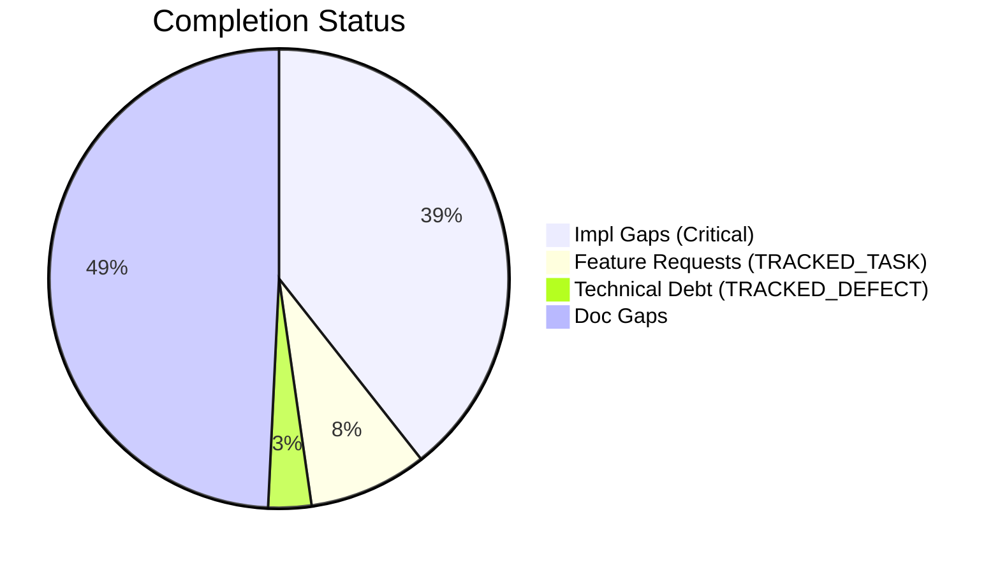
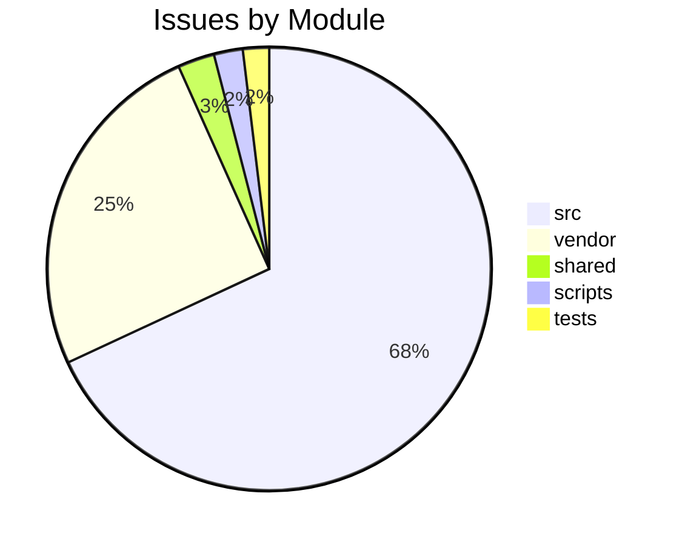

# Completist Report: 2026-03-11

## Executive Summary
- **Critical Gaps**: 416
- **Feature Gaps (TRACKED_TASK)**: 88
- **Technical Debt**: 32
- **Documentation Gaps**: 520

## Visualization
### Status Overview

### Top Impacted Modules

## Critical Incomplete (Top 50)
| File | Line | Type | Impact | Coverage | Complexity |
|---|---|---|---|---|---|
| `./vendor/ud-tools/src/shared/python/plot_engine/protocols.py` | 29 | Stub | 5 | 3 | 4 |
| `./vendor/ud-tools/src/shared/python/plot_engine/protocols.py` | 33 | Stub | 5 | 3 | 4 |
| `./vendor/ud-tools/src/shared/python/plot_engine/protocols.py` | 45 | Stub | 5 | 3 | 4 |
| `./vendor/ud-tools/src/shared/python/plot_engine/protocols.py` | 58 | Stub | 5 | 3 | 4 |
| `./vendor/ud-tools/src/shared/python/plot_engine/protocols.py` | 62 | Stub | 5 | 3 | 4 |
| `./vendor/ud-tools/src/shared/python/model_generation/library/repository.py` | 40 | Stub | 5 | 3 | 4 |
| `./vendor/ud-tools/src/shared/python/model_generation/library/repository.py` | 46 | Stub | 5 | 3 | 4 |
| `./vendor/ud-tools/src/shared/python/model_generation/library/repository.py` | 51 | Stub | 5 | 3 | 4 |
| `./vendor/ud-tools/src/shared/python/model_generation/library/repository.py` | 56 | Stub | 5 | 3 | 4 |
| `./vendor/ud-tools/src/shared/python/model_generation/builders/base_builder.py` | 183 | Stub | 5 | 3 | 4 |
| `./vendor/ud-tools/src/shared/python/model_generation/builders/base_builder.py` | 193 | Stub | 5 | 3 | 4 |
| `./vendor/ud-tools/src/shared/python/model_generation/plugins/__init__.py` | 21 | Stub | 5 | 3 | 4 |
| `./vendor/ud-tools/src/shared/python/model_generation/plugins/__init__.py` | 27 | Stub | 5 | 3 | 4 |
| `./vendor/ud-tools/src/shared/python/model_generation/plugins/__init__.py` | 32 | Stub | 5 | 3 | 4 |
| `./vendor/ud-tools/src/shared/python/model_generation/plugins/__init__.py` | 36 | Stub | 5 | 3 | 4 |
| `./vendor/ud-tools/src/shared/python/model_generation/editor/editor_clipboard.py` | 35 | Stub | 5 | 3 | 4 |
| `./vendor/ud-tools/src/shared/python/model_generation/editor/editor_modifications.py` | 41 | Stub | 5 | 3 | 4 |
| `./vendor/ud-tools/src/shared/python/model_generation/editor/editor_modifications.py` | 43 | Stub | 5 | 3 | 4 |
| `./vendor/ud-tools/src/shared/python/model_generation/editor/editor_modifications.py` | 45 | Stub | 5 | 3 | 4 |
| `./vendor/ud-tools/src/shared/python/model_generation/editor/editor_modifications.py` | 47 | Stub | 5 | 3 | 4 |
| `./vendor/ud-tools/src/shared/python/calc_backend/protocols.py` | 35 | Stub | 5 | 3 | 4 |
| `./vendor/ud-tools/src/shared/python/calc_backend/protocols.py` | 48 | Stub | 5 | 3 | 4 |
| `./vendor/ud-tools/src/shared/python/calc_backend/protocols.py` | 61 | Stub | 5 | 3 | 4 |
| `./vendor/ud-tools/src/shared/python/calc_backend/protocols.py` | 65 | Stub | 5 | 3 | 4 |
| `./vendor/ud-tools/src/shared/python/upstream_drift_tools/protocols.py` | 78 | Stub | 5 | 3 | 4 |
| `./vendor/ud-tools/src/shared/python/upstream_drift_tools/protocols.py` | 83 | Stub | 5 | 3 | 4 |
| `./vendor/ud-tools/src/shared/python/upstream_drift_tools/protocols.py` | 87 | Stub | 5 | 3 | 4 |
| `./vendor/ud-tools/src/shared/python/upstream_drift_tools/protocols.py` | 91 | Stub | 5 | 3 | 4 |
| `./vendor/ud-tools/src/shared/python/upstream_drift_tools/protocols.py` | 108 | Stub | 5 | 3 | 4 |
| `./vendor/ud-tools/src/shared/python/upstream_drift_tools/protocols.py` | 121 | Stub | 5 | 3 | 4 |
| `./vendor/ud-tools/src/shared/python/upstream_drift_tools/protocols.py` | 134 | Stub | 5 | 3 | 4 |
| `./vendor/ud-tools/src/shared/python/upstream_drift_tools/protocols.py` | 138 | Stub | 5 | 3 | 4 |
| `./vendor/ud-tools/src/shared/python/upstream_drift_tools/protocols.py` | 151 | Stub | 5 | 3 | 4 |
| `./vendor/ud-tools/src/shared/python/upstream_drift_tools/calculators/base.py` | 20 | Stub | 5 | 3 | 4 |
| `./vendor/ud-tools/src/shared/python/upstream_drift_tools/process_calculators/acid_gas_dewpoint_calculator.py` | 787 | Stub | 5 | 3 | 4 |
| `./vendor/ud-tools/src/shared/python/upstream_drift_tools/process_calculators/acid_gas_dewpoint_calculator.py` | 790 | Stub | 5 | 3 | 4 |
| `./vendor/ud-tools/src/shared/python/upstream_drift_tools/process_calculators/pressure_drop_calculator/__init__.py` | 221 | Stub | 5 | 3 | 4 |
| `./vendor/ud-tools/src/shared/python/upstream_drift_tools/process_calculators/psa_package/psa_gui.py` | 156 | Stub | 5 | 3 | 4 |
| `./vendor/ud-tools/src/shared/python/upstream_drift_tools/ui/mixins/calculator_state_mixin.py` | 433 | Stub | 5 | 3 | 4 |
| `./vendor/ud-tools/src/shared/python/upstream_drift_tools/ui/widgets/data_processor_widget.py` | 594 | Stub | 5 | 3 | 4 |
| `./vendor/ud-tools/src/shared/python/upstream_drift_tools/ui/widgets/mixins/data_processor_ops.py` | 53 | Stub | 5 | 3 | 4 |
| `./vendor/ud-tools/src/shared/python/upstream_drift_tools/ui/widgets/mixins/data_processor_ops.py` | 54 | Stub | 5 | 3 | 4 |
| `./vendor/ud-tools/src/shared/python/upstream_drift_tools/ui/widgets/mixins/data_processor_ops.py` | 55 | Stub | 5 | 3 | 4 |
| `./vendor/ud-tools/src/shared/python/upstream_drift_tools/ui/widgets/mixins/data_processor_ops.py` | 56 | Stub | 5 | 3 | 4 |
| `./vendor/ud-tools/src/shared/python/theme/protocols.py` | 28 | Stub | 5 | 3 | 4 |
| `./vendor/ud-tools/src/shared/python/theme/protocols.py` | 32 | Stub | 5 | 3 | 4 |
| `./vendor/ud-tools/src/shared/python/theme/protocols.py` | 37 | Stub | 5 | 3 | 4 |
| `./vendor/ud-tools/src/shared/python/theme/protocols.py` | 50 | Stub | 5 | 3 | 4 |
| `./vendor/ud-tools/src/shared/python/theme/protocols.py` | 54 | Stub | 5 | 3 | 4 |
| `./vendor/ud-tools/src/shared/python/theme/protocols.py` | 67 | Stub | 5 | 3 | 4 |

## Feature Gap Matrix
| Module | Feature Gap | Type |
|---|---|---|
| `./REVIEW_SUMMARY.txt` | 4. TRACKED_TASK/TRACKED_DEFECT blocker too aggressive (doesn't allow issue references) | TRACKED_TASK |
| `./scripts/refresh_completist_data.py` | "TRACKED_TASK\|TRACKED_DEFECT\|XXX\|HACK\|TEMP", | TRACKED_TASK |
| `./scripts/pragmatic_programmer_review.py` | """Report high TRACKED_TASK counts as a technical debt indicator.""" | TRACKED_TASK |
| `./scripts/pragmatic_programmer_review.py` | if "TRACKED_TASK" in content: | TRACKED_TASK |
| `./scripts/pragmatic_programmer_review.py` | "title": f"High TRACKED_TASK count ({len(todos)})", | TRACKED_TASK |
| `./scripts/generate_todo_fixme_register.py` | ["rg", "-n", "TRACKED_TASK\|TRACKED_DEFECT", "src", "tests", "scripts"], | TRACKED_TASK |
| `./scripts/generate_todo_fixme_register.py` | "# TRACKED_TASK/TRACKED_DEFECT Debt Register", | TRACKED_TASK |
| `./scripts/generate_todo_fixme_register.py` | "This register is generated from inline TRACKED_TASK/TRACKED_DEFECT markers.", | TRACKED_TASK |
| `./scripts/generate_todo_fixme_register.py` | marker = "TRACKED_TASK" if "TRACKED_TASK" in text else "TRACKED_DEFECT" | TRACKED_TASK |
| `./BUILD_INFRASTRUCTURE_REVIEW.md` | - Placeholder (TRACKED_TASK/TRACKED_DEFECT) blocker | TRACKED_TASK |
| `./BUILD_INFRASTRUCTURE_REVIEW.md` | 3. **TRACKED_TASK/TRACKED_DEFECT check is blocking:** CI fails if any TODOs found | TRACKED_TASK |
| `./BUILD_INFRASTRUCTURE_REVIEW.md` | 3. TRACKED_TASK/TRACKED_DEFECT blocker is too aggressive | TRACKED_TASK |
| `./BUILD_INFRASTRUCTURE_REVIEW.md` | - **Fix:** Update check to allow `TRACKED_TASK #123` format | TRACKED_TASK |
| `./BUILD_INFRASTRUCTURE_REVIEW.md` | echo "::error::Orphaned placeholders. Link to GitHub issues: # TRACKED_TASK #123" | TRACKED_TASK |
| `./BUILD_INFRASTRUCTURE_REVIEW.md` | - [ ] Fix TRACKED_TASK/TRACKED_DEFECT check to allow references: `# TRACKED_TASK #123` | TRACKED_TASK |
| `./tests/tools/test_code_quality_check.py` | lines = ["# TRACKED_TASK: fix this", "def test():", "    ...  ", "    pass"] | TRACKED_TASK |
| `./tests/tools/test_code_quality_check.py` | assert any("TRACKED_TASK placeholder" in t for t in types) | TRACKED_TASK |
| `./tests/tools/test_code_quality_check.py` | lines = ["# TRACKED_TASK: internal marker"] | TRACKED_TASK |
| `./tests/tools/test_code_quality_check.py` | f.write_text("# TRACKED_TASK: fix this\n") | TRACKED_TASK |
| `./tests/tools/test_code_quality_check.py` | assert any("TRACKED_TASK" in i[1] for i in issues) | TRACKED_TASK |
| `./vendor/ud-tools/drafts/Jules-Code-Quality-Reviewer.yml` | 5. **Placeholders**: Identify placeholder code (TRACKED_TASK, TRACKED_DEFECT, NotImplemented, pass statements) | TRACKED_TASK |
| `./vendor/ud-tools/scripts/generate_comprehensive_assessment.py` | stats["todos"] += content.count("TRACKED_TASK") | TRACKED_TASK |
| `./vendor/ud-tools/scripts/generate_comprehensive_assessment.py` | grades["O"] = (max(0, score_o), f"Technical Debt (TRACKED_TASK+TRACKED_DEFECT): {debt}") | TRACKED_TASK |
| `./vendor/ud-tools/scripts/generate_assessments.py` | - **Markers**: 445 `TRACKED_TASK` and 140 `TRACKED_DEFECT` markers indicate significant unfinished work. | TRACKED_TASK |
| `./vendor/ud-tools/scripts/generate_assessments.py` | -   445 `TRACKED_TASK` markers. | TRACKED_TASK |
| `./vendor/ud-tools/scripts/generate_assessments.py` | -   Convert valid `TRACKED_TASK` items into GitHub Issues. | TRACKED_TASK |
| `./vendor/ud-tools/scripts/generate_assessments.py` | f.write("    - **Issue**: 445 `TRACKED_TASK` markers.\n") | TRACKED_TASK |
| `./vendor/ud-tools/scripts/generate_fresh_assessments.py` | stats["todos"] += content.count("TRACKED_TASK") | TRACKED_TASK |
| `./vendor/ud-tools/scripts/pragmatic_programmer_review.py` | if "TRACKED_TASK" in content: | TRACKED_TASK |
| `./vendor/ud-tools/scripts/pragmatic_programmer_review.py` | "title": f"High TRACKED_TASK count ({len(todos)})", | TRACKED_TASK |
| `./vendor/ud-tools/tests/tools/test_matlab_quality_utils.py` | Path("script.m"), "% TRACKED_TASK: fix this", 5, issues | TRACKED_TASK |
| `./vendor/ud-tools/tests/tools/test_matlab_quality_utils.py` | assert "TRACKED_TASK" in issues[0] | TRACKED_TASK |
| `./vendor/ud-tools/tests/tools/test_matlab_quality_utils.py` | "% TRACKED_TASK", | TRACKED_TASK |
| `./vendor/ud-tools/tests/tools/test_matlab_quality_utils.py` | """m-file with TRACKED_TASK must produce at least one issue.""" | TRACKED_TASK |
| `./vendor/ud-tools/tests/tools/test_matlab_quality_utils.py` | (matlab / "dirty.m").write_text("function y = foo(x)\n% TRACKED_TASK: fix\ny = x;\nend\n") | TRACKED_TASK |
| `./vendor/ud-tools/tests/tools/test_matlab_quality_utils.py` | "function bad()\n% TRACKED_TASK: fill in\nglobal myVar\neval('x+1');\nend\n" | TRACKED_TASK |
| `./vendor/ud-tools/tests/tools/test_quality_utils.py` | lines = ["# TRACKED_TASK: fix this eventually"] | TRACKED_TASK |
| `./vendor/ud-tools/tests/tools/test_quality_utils.py` | assert "TRACKED_TASK" in issues[0][1] | TRACKED_TASK |
| `./vendor/ud-tools/tests/tools/test_quality_utils.py` | lines = ["# TRACKED_TASK: something"] | TRACKED_TASK |
| `./vendor/ud-tools/tests/tools/test_quality_utils.py` | f.write_text("# TRACKED_TASK: clean me up\n", encoding="utf-8") | TRACKED_TASK |
| `./vendor/ud-tools/.cursor/rules/.cursorrules.md` | - **NEVER USE PLACEHOLDERS** → No `TRACKED_TASK`, `TRACKED_DEFECT`, `...`, `pass`, `NotImplementedError`, `<your-valu | TRACKED_TASK |
| `./vendor/ud-tools/.cursor/rules/.cursorrules.md` | - [X] Zero TRACKED_TASK/TRACKED_DEFECT/pass in diff | TRACKED_TASK |
| `./vendor/ud-tools/.cursor/rules/.cursorrules.md` | # TRACKED_TASK: implement this properly | TRACKED_TASK |
| `./vendor/ud-tools/src/data_processing/data_processor/python/data_processor/core/script_generator.py` | f"{prefix}# TRACKED_TASK: Implement custom operation", | TRACKED_TASK |
| `./vendor/ud-tools/src/media_processing/video_processor/apps/web/lib/golf/swingAnalyzer.ts` | swingType: SwingType.UNKNOWN, // TRACKED_TASK: Implement swing type detection | TRACKED_TASK |
| `./vendor/ud-tools/src/media_processing/video_processor/apps/web/lib/golf/swingAnalyzer.ts` | armHang: 'good', // TRACKED_TASK: Implement arm hang detection | TRACKED_TASK |
| `./vendor/ud-tools/src/media_processing/video_processor/apps/web/lib/sanitize.ts` | // TRACKED_TASK: Parse and validate RGB values | TRACKED_TASK |
| `./vendor/ud-tools/src/media_processing/video_processor/apps/web/app/page.tsx` | // TRACKED_TASK: Move fps to client-side config or use from video metadata | TRACKED_TASK |
| `./vendor/ud-tools/src/media_processing/video_processor/apps/web/app/page.tsx` | // TRACKED_TASK(#663): Save to database when backend API is available. | TRACKED_TASK |
| `./vendor/ud-tools/src/media_processing/video_processor/apps/web/app/page.tsx` | // TRACKED_TASK(#663): Save pose data to database when backend API is available. | TRACKED_TASK |

## Technical Debt Register
| File | Line | Issue | Type |
|---|---|---|---|
| `./full_collect.txt` | 4666 | Postcondition: All codes follow GMS-XXX-NNN format. | XXX |
| `./full_collect.txt` | 17580 | Every error code must follow GMS-XXX-NNN pattern. | XXX |
| `./tests/tools/test_code_quality_check.py` | 83 | lines = ["# TRACKED_DEFECT: broken logic"] | TRACKED_DEFECT |
| `./tests/tools/test_code_quality_check.py` | 85 | assert any("TRACKED_DEFECT" in i[1] for i in issues) | TRACKED_DEFECT |
| `./tests/unit/utils/test_error_codes.py` | 39 | """Every error code must follow GMS-XXX-NNN pattern.""" | XXX |
| `./tests/unit/utils/test_error_codes.py` | 42 | assert len(parts) == 3, f"{code.name} doesn't follow GMS-XXX-NNN" | XXX |
| `./tests/unit/api/test_error_codes.py` | 36 | """Postcondition: All codes follow GMS-XXX-NNN format.""" | XXX |
| `./vendor/ud-tools/scripts/generate_comprehensive_assessment.py` | 143 | stats["fixmes"] += content.count("TRACKED_DEFECT") | TRACKED_DEFECT |
| `./vendor/ud-tools/scripts/generate_assessments.py` | 214 | -   140 `TRACKED_DEFECT` markers. | TRACKED_DEFECT |
| `./vendor/ud-tools/scripts/generate_assessments.py` | 217 | -   Audit all `TRACKED_DEFECT` items and resolve high-priority ones. | TRACKED_DEFECT |
| `./vendor/ud-tools/scripts/generate_fresh_assessments.py` | 121 | stats["fixmes"] += content.count("TRACKED_DEFECT") | TRACKED_DEFECT |
| `./vendor/ud-tools/tests/tools/test_matlab_quality_utils.py` | 95 | Path("script.m"), "% TRACKED_DEFECT: broken", 3, issues | TRACKED_DEFECT |
| `./vendor/ud-tools/tests/tools/test_matlab_quality_utils.py` | 97 | assert any("TRACKED_DEFECT" in i for i in issues) | TRACKED_DEFECT |
| `./vendor/ud-tools/src/tools/matlab_quality_utils.py` | 320 | (r"\bFIXME\b", "TRACKED_DEFECT placeholder found"), | TRACKED_DEFECT |
| `./vendor/ud-tools/src/tools/matlab_quality_utils.py` | 321 | (r"\bHACK\b", "HACK comment found"), | HACK |
| `./vendor/ud-tools/src/tools/matlab_quality_utils.py` | 322 | (r"\bXXX\b", "XXX comment found"), | XXX |
| `./vendor/ud-tools/src/tools/quality_utils.py` | 51 | "Angle bracket TRACKED_DEFECT placeholder", | TRACKED_DEFECT |
| `./pytest_collect_out.txt` | 4666 | Postcondition: All codes follow GMS-XXX-NNN format. | XXX |
| `./pytest_collect_out.txt` | 17420 | Every error code must follow GMS-XXX-NNN pattern. | XXX |
| `./shared/models/opensim/opensim-models/Tutorials/doc/styles/site.css` | 3404 | html body { /* HACK: Temporary fix for CONF-15412 */ | HACK |
| `./src/api/utils/error_codes.py` | 53 | # General Errors (GMS-GEN-XXX) | XXX |
| `./src/api/utils/error_codes.py` | 59 | # Engine Errors (GMS-ENG-XXX) | XXX |
| `./src/api/utils/error_codes.py` | 67 | # Simulation Errors (GMS-SIM-XXX) | XXX |
| `./src/api/utils/error_codes.py` | 76 | # Video Errors (GMS-VID-XXX) | XXX |
| `./src/api/utils/error_codes.py` | 83 | # Analysis Errors (GMS-ANL-XXX) | XXX |
| `./src/api/utils/error_codes.py` | 88 | # Auth Errors (GMS-AUT-XXX) | XXX |
| `./src/api/utils/error_codes.py` | 95 | # Validation Errors (GMS-VAL-XXX) | XXX |
| `./src/api/utils/error_codes.py` | 101 | # Resource Errors (GMS-RES-XXX) | XXX |
| `./src/api/utils/error_codes.py` | 106 | # System Errors (GMS-SYS-XXX) | XXX |
| `./src/tools/matlab_utilities/scripts/matlab_quality_check.py` | 77 | (r"\bHACK\b", "HACK comment found"), | HACK |
| `./src/tools/matlab_utilities/scripts/matlab_quality_check.py` | 78 | (r"\bXXX\b", "XXX comment found"), | XXX |
| `./src/shared/models/opensim/opensim-models/Tutorials/doc/styles/site.css` | 3404 | html body { /* HACK: Temporary fix for CONF-15412 */ | HACK |

## Recommended Implementation Order
Prioritized by Impact (High) and Complexity (Low).
| Priority | File | Issue | Metrics (I/C/C) |
|---|---|---|---|
| 1 | `./src/engines/pendulum_models/tools/matlab_utilities/README.md` | - TRACKED_TASK, TRACKED_DEFECT, HACK, XXX placeholders | 5/2/3 |
| 2 | `./src/engines/Simscape_Multibody_Models/3D_Golf_Model/matlab_utilities/README.md` | - TRACKED_TASK, TRACKED_DEFECT, HACK, XXX placeholders | 5/2/3 |
| 3 | `./src/engines/physics_engines/pinocchio/tools/matlab_utilities/README.md` | - TRACKED_TASK, TRACKED_DEFECT, HACK, XXX placeholders | 5/2/3 |
| 4 | `./src/engines/physics_engines/drake/tools/matlab_utilities/README.md` | - TRACKED_TASK, TRACKED_DEFECT, HACK, XXX placeholders | 5/2/3 |
| 5 | `./vendor/ud-tools/src/shared/python/plot_engine/protocols.py` | render | 5/3/4 |
| 6 | `./vendor/ud-tools/src/shared/python/plot_engine/protocols.py` | to_image | 5/3/4 |
| 7 | `./vendor/ud-tools/src/shared/python/plot_engine/protocols.py` | convert | 5/3/4 |
| 8 | `./vendor/ud-tools/src/shared/python/plot_engine/protocols.py` | get_colors | 5/3/4 |
| 9 | `./vendor/ud-tools/src/shared/python/plot_engine/protocols.py` | apply_to_figure | 5/3/4 |
| 10 | `./vendor/ud-tools/src/shared/python/model_generation/library/repository.py` | name | 5/3/4 |
| 11 | `./vendor/ud-tools/src/shared/python/model_generation/library/repository.py` | description | 5/3/4 |
| 12 | `./vendor/ud-tools/src/shared/python/model_generation/library/repository.py` | list_models | 5/3/4 |
| 13 | `./vendor/ud-tools/src/shared/python/model_generation/library/repository.py` | download_model | 5/3/4 |
| 14 | `./vendor/ud-tools/src/shared/python/model_generation/builders/base_builder.py` | build | 5/3/4 |
| 15 | `./vendor/ud-tools/src/shared/python/model_generation/builders/base_builder.py` | clear | 5/3/4 |
| 16 | `./vendor/ud-tools/src/shared/python/model_generation/plugins/__init__.py` | name | 5/3/4 |
| 17 | `./vendor/ud-tools/src/shared/python/model_generation/plugins/__init__.py` | version | 5/3/4 |
| 18 | `./vendor/ud-tools/src/shared/python/model_generation/plugins/__init__.py` | initialize | 5/3/4 |
| 19 | `./vendor/ud-tools/src/shared/python/model_generation/plugins/__init__.py` | shutdown | 5/3/4 |
| 20 | `./vendor/ud-tools/src/shared/python/model_generation/editor/editor_clipboard.py` | get_connecting_joint | 5/3/4 |

## Issues Created
- Created `docs/assessments/issues/Issue_2123_Incomplete_Stub_in_protocols_py_29.md`
- Created `docs/assessments/issues/Issue_2124_Incomplete_Stub_in_protocols_py_33.md`
- Created `docs/assessments/issues/Issue_2125_Incomplete_Stub_in_protocols_py_45.md`
- Created `docs/assessments/issues/Issue_2126_Incomplete_Stub_in_protocols_py_58.md`
- Created `docs/assessments/issues/Issue_2127_Incomplete_Stub_in_protocols_py_62.md`
- Created `docs/assessments/issues/Issue_049_Incomplete_Stub_in_repository_py_40.md`
- Created `docs/assessments/issues/Issue_050_Incomplete_Stub_in_repository_py_46.md`
- Created `docs/assessments/issues/Issue_051_Incomplete_Stub_in_repository_py_51.md`
- Created `docs/assessments/issues/Issue_052_Incomplete_Stub_in_repository_py_56.md`
- Created `docs/assessments/issues/Issue_053_Incomplete_Stub_in_base_builder_py_183.md`
- Created `docs/assessments/issues/Issue_054_Incomplete_Stub_in_base_builder_py_193.md`
- Created `docs/assessments/issues/Issue_055_Incomplete_Stub_in___init___py_21.md`
- Created `docs/assessments/issues/Issue_056_Incomplete_Stub_in___init___py_27.md`
- Created `docs/assessments/issues/Issue_057_Incomplete_Stub_in___init___py_32.md`
- Created `docs/assessments/issues/Issue_058_Incomplete_Stub_in___init___py_36.md`
- Created `docs/assessments/issues/Issue_2138_Incomplete_Stub_in_editor_clipboard_py_35.md`
- Created `docs/assessments/issues/Issue_2139_Incomplete_Stub_in_editor_modifications_py_41.md`
- Created `docs/assessments/issues/Issue_2140_Incomplete_Stub_in_editor_modifications_py_43.md`
- Created `docs/assessments/issues/Issue_2141_Incomplete_Stub_in_editor_modifications_py_45.md`
- Created `docs/assessments/issues/Issue_2142_Incomplete_Stub_in_editor_modifications_py_47.md`
- Created `docs/assessments/issues/Issue_2143_Incomplete_Stub_in_protocols_py_35.md`
- Created `docs/assessments/issues/Issue_2144_Incomplete_Stub_in_protocols_py_48.md`
- Created `docs/assessments/issues/Issue_2145_Incomplete_Stub_in_protocols_py_61.md`
- Created `docs/assessments/issues/Issue_2146_Incomplete_Stub_in_protocols_py_65.md`
- Created `docs/assessments/issues/Issue_2147_Incomplete_Stub_in_protocols_py_78.md`
- Created `docs/assessments/issues/Issue_2148_Incomplete_Stub_in_protocols_py_83.md`
- Created `docs/assessments/issues/Issue_2149_Incomplete_Stub_in_protocols_py_87.md`
- Created `docs/assessments/issues/Issue_2150_Incomplete_Stub_in_protocols_py_91.md`
- Created `docs/assessments/issues/Issue_2151_Incomplete_Stub_in_protocols_py_108.md`
- Created `docs/assessments/issues/Issue_2152_Incomplete_Stub_in_protocols_py_121.md`
- Created `docs/assessments/issues/Issue_2153_Incomplete_Stub_in_protocols_py_134.md`
- Created `docs/assessments/issues/Issue_2154_Incomplete_Stub_in_protocols_py_138.md`
- Created `docs/assessments/issues/Issue_2155_Incomplete_Stub_in_protocols_py_151.md`
- Created `docs/assessments/issues/Issue_2156_Incomplete_Stub_in_base_py_20.md`
- Created `docs/assessments/issues/Issue_2157_Incomplete_Stub_in_acid_gas_dewpoint_calculator_py_787.md`
- Created `docs/assessments/issues/Issue_2158_Incomplete_Stub_in_acid_gas_dewpoint_calculator_py_790.md`
- Created `docs/assessments/issues/Issue_073_Incomplete_Stub_in___init___py_221.md`
- Created `docs/assessments/issues/Issue_074_Incomplete_Stub_in_psa_gui_py_156.md`
- Created `docs/assessments/issues/Issue_2161_Incomplete_Stub_in_calculator_state_mixin_py_433.md`
- Created `docs/assessments/issues/Issue_2162_Incomplete_Stub_in_data_processor_widget_py_594.md`
- Created `docs/assessments/issues/Issue_2163_Incomplete_Stub_in_data_processor_ops_py_53.md`
- Created `docs/assessments/issues/Issue_2164_Incomplete_Stub_in_data_processor_ops_py_54.md`
- Created `docs/assessments/issues/Issue_2165_Incomplete_Stub_in_data_processor_ops_py_55.md`
- Created `docs/assessments/issues/Issue_2166_Incomplete_Stub_in_data_processor_ops_py_56.md`
- Created `docs/assessments/issues/Issue_2167_Incomplete_Stub_in_protocols_py_28.md`
- Created `docs/assessments/issues/Issue_2168_Incomplete_Stub_in_protocols_py_32.md`
- Created `docs/assessments/issues/Issue_2169_Incomplete_Stub_in_protocols_py_37.md`
- Created `docs/assessments/issues/Issue_2170_Incomplete_Stub_in_protocols_py_50.md`
- Created `docs/assessments/issues/Issue_2171_Incomplete_Stub_in_protocols_py_54.md`
- Created `docs/assessments/issues/Issue_2172_Incomplete_Stub_in_protocols_py_67.md`