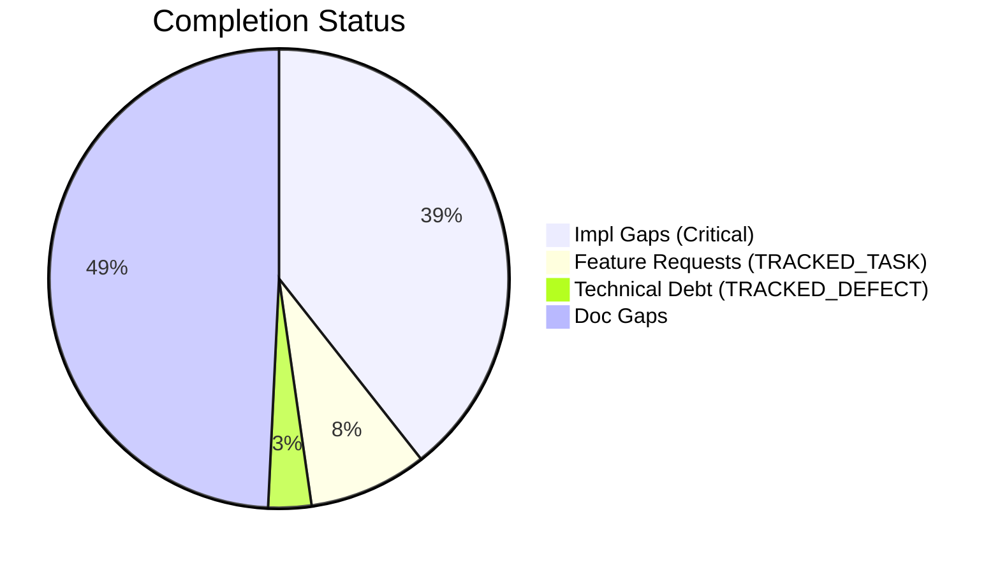
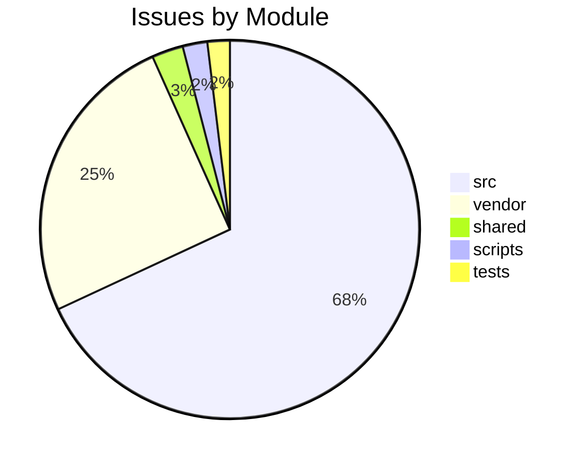

# Completist Report: 2026-03-11

## Executive Summary

- **Critical Gaps**: 416
- **Feature Gaps (TRACKED_TASK)**: 88
- **Technical Debt**: 32
- **Documentation Gaps**: 520

## Visualization

### Status Overview

### Top Impacted Modules

## Critical Incomplete (Top 50)

| File                                                                                                                | Line | Type | Impact | Coverage | Complexity |
| ------------------------------------------------------------------------------------------------------------------- | ---- | ---- | ------ | -------- | ---------- |
| `./vendor/ud-tools/src/shared/python/plot_engine/protocols.py`                                                      | 29   | Stub | 5      | 3        | 4          |
| `./vendor/ud-tools/src/shared/python/plot_engine/protocols.py`                                                      | 33   | Stub | 5      | 3        | 4          |
| `./vendor/ud-tools/src/shared/python/plot_engine/protocols.py`                                                      | 45   | Stub | 5      | 3        | 4          |
| `./vendor/ud-tools/src/shared/python/plot_engine/protocols.py`                                                      | 58   | Stub | 5      | 3        | 4          |
| `./vendor/ud-tools/src/shared/python/plot_engine/protocols.py`                                                      | 62   | Stub | 5      | 3        | 4          |
| `./vendor/ud-tools/src/shared/python/model_generation/library/repository.py`                                        | 40   | Stub | 5      | 3        | 4          |
| `./vendor/ud-tools/src/shared/python/model_generation/library/repository.py`                                        | 46   | Stub | 5      | 3        | 4          |
| `./vendor/ud-tools/src/shared/python/model_generation/library/repository.py`                                        | 51   | Stub | 5      | 3        | 4          |
| `./vendor/ud-tools/src/shared/python/model_generation/library/repository.py`                                        | 56   | Stub | 5      | 3        | 4          |
| `./vendor/ud-tools/src/shared/python/model_generation/builders/base_builder.py`                                     | 183  | Stub | 5      | 3        | 4          |
| `./vendor/ud-tools/src/shared/python/model_generation/builders/base_builder.py`                                     | 193  | Stub | 5      | 3        | 4          |
| `./vendor/ud-tools/src/shared/python/model_generation/plugins/__init__.py`                                          | 21   | Stub | 5      | 3        | 4          |
| `./vendor/ud-tools/src/shared/python/model_generation/plugins/__init__.py`                                          | 27   | Stub | 5      | 3        | 4          |
| `./vendor/ud-tools/src/shared/python/model_generation/plugins/__init__.py`                                          | 32   | Stub | 5      | 3        | 4          |
| `./vendor/ud-tools/src/shared/python/model_generation/plugins/__init__.py`                                          | 36   | Stub | 5      | 3        | 4          |
| `./vendor/ud-tools/src/shared/python/model_generation/editor/editor_clipboard.py`                                   | 35   | Stub | 5      | 3        | 4          |
| `./vendor/ud-tools/src/shared/python/model_generation/editor/editor_modifications.py`                               | 41   | Stub | 5      | 3        | 4          |
| `./vendor/ud-tools/src/shared/python/model_generation/editor/editor_modifications.py`                               | 43   | Stub | 5      | 3        | 4          |
| `./vendor/ud-tools/src/shared/python/model_generation/editor/editor_modifications.py`                               | 45   | Stub | 5      | 3        | 4          |
| `./vendor/ud-tools/src/shared/python/model_generation/editor/editor_modifications.py`                               | 47   | Stub | 5      | 3        | 4          |
| `./vendor/ud-tools/src/shared/python/calc_backend/protocols.py`                                                     | 35   | Stub | 5      | 3        | 4          |
| `./vendor/ud-tools/src/shared/python/calc_backend/protocols.py`                                                     | 48   | Stub | 5      | 3        | 4          |
| `./vendor/ud-tools/src/shared/python/calc_backend/protocols.py`                                                     | 61   | Stub | 5      | 3        | 4          |
| `./vendor/ud-tools/src/shared/python/calc_backend/protocols.py`                                                     | 65   | Stub | 5      | 3        | 4          |
| `./vendor/ud-tools/src/shared/python/upstream_drift_tools/protocols.py`                                             | 78   | Stub | 5      | 3        | 4          |
| `./vendor/ud-tools/src/shared/python/upstream_drift_tools/protocols.py`                                             | 83   | Stub | 5      | 3        | 4          |
| `./vendor/ud-tools/src/shared/python/upstream_drift_tools/protocols.py`                                             | 87   | Stub | 5      | 3        | 4          |
| `./vendor/ud-tools/src/shared/python/upstream_drift_tools/protocols.py`                                             | 91   | Stub | 5      | 3        | 4          |
| `./vendor/ud-tools/src/shared/python/upstream_drift_tools/protocols.py`                                             | 108  | Stub | 5      | 3        | 4          |
| `./vendor/ud-tools/src/shared/python/upstream_drift_tools/protocols.py`                                             | 121  | Stub | 5      | 3        | 4          |
| `./vendor/ud-tools/src/shared/python/upstream_drift_tools/protocols.py`                                             | 134  | Stub | 5      | 3        | 4          |
| `./vendor/ud-tools/src/shared/python/upstream_drift_tools/protocols.py`                                             | 138  | Stub | 5      | 3        | 4          |
| `./vendor/ud-tools/src/shared/python/upstream_drift_tools/protocols.py`                                             | 151  | Stub | 5      | 3        | 4          |
| `./vendor/ud-tools/src/shared/python/upstream_drift_tools/calculators/base.py`                                      | 20   | Stub | 5      | 3        | 4          |
| `./vendor/ud-tools/src/shared/python/upstream_drift_tools/process_calculators/acid_gas_dewpoint_calculator.py`      | 787  | Stub | 5      | 3        | 4          |
| `./vendor/ud-tools/src/shared/python/upstream_drift_tools/process_calculators/acid_gas_dewpoint_calculator.py`      | 790  | Stub | 5      | 3        | 4          |
| `./vendor/ud-tools/src/shared/python/upstream_drift_tools/process_calculators/pressure_drop_calculator/__init__.py` | 221  | Stub | 5      | 3        | 4          |
| `./vendor/ud-tools/src/shared/python/upstream_drift_tools/process_calculators/psa_package/psa_gui.py`               | 156  | Stub | 5      | 3        | 4          |
| `./vendor/ud-tools/src/shared/python/upstream_drift_tools/ui/mixins/calculator_state_mixin.py`                      | 433  | Stub | 5      | 3        | 4          |
| `./vendor/ud-tools/src/shared/python/upstream_drift_tools/ui/widgets/data_processor_widget.py`                      | 594  | Stub | 5      | 3        | 4          |
| `./vendor/ud-tools/src/shared/python/upstream_drift_tools/ui/widgets/mixins/data_processor_ops.py`                  | 53   | Stub | 5      | 3        | 4          |
| `./vendor/ud-tools/src/shared/python/upstream_drift_tools/ui/widgets/mixins/data_processor_ops.py`                  | 54   | Stub | 5      | 3        | 4          |
| `./vendor/ud-tools/src/shared/python/upstream_drift_tools/ui/widgets/mixins/data_processor_ops.py`                  | 55   | Stub | 5      | 3        | 4          |
| `./vendor/ud-tools/src/shared/python/upstream_drift_tools/ui/widgets/mixins/data_processor_ops.py`                  | 56   | Stub | 5      | 3        | 4          |
| `./vendor/ud-tools/src/shared/python/theme/protocols.py`                                                            | 28   | Stub | 5      | 3        | 4          |
| `./vendor/ud-tools/src/shared/python/theme/protocols.py`                                                            | 32   | Stub | 5      | 3        | 4          |
| `./vendor/ud-tools/src/shared/python/theme/protocols.py`                                                            | 37   | Stub | 5      | 3        | 4          |
| `./vendor/ud-tools/src/shared/python/theme/protocols.py`                                                            | 50   | Stub | 5      | 3        | 4          |
| `./vendor/ud-tools/src/shared/python/theme/protocols.py`                                                            | 54   | Stub | 5      | 3        | 4          |
| `./vendor/ud-tools/src/shared/python/theme/protocols.py`                                                            | 67   | Stub | 5      | 3        | 4          |

## Feature Gap Matrix
