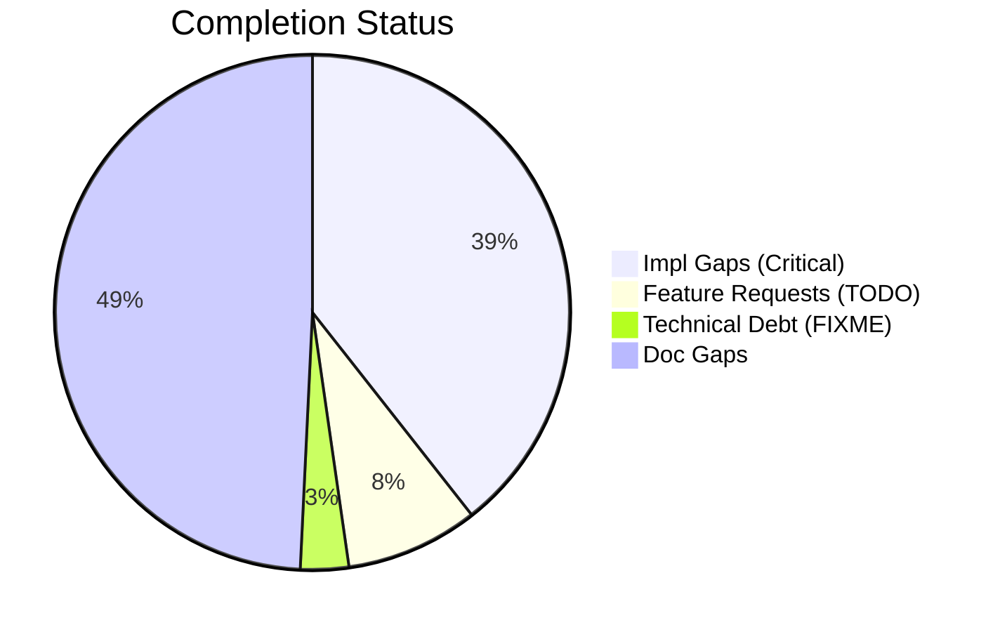
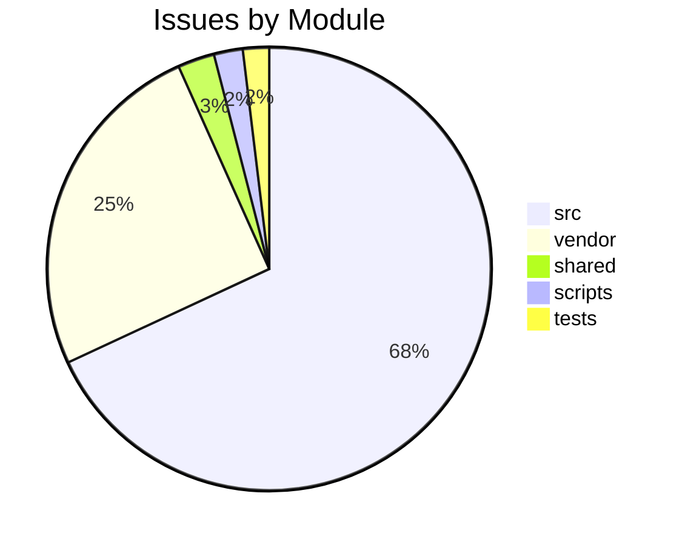

# Completist Report: 2026-03-12

## Executive Summary
- **Critical Gaps**: 416
- **Feature Gaps (TODO)**: 88
- **Technical Debt**: 32
- **Documentation Gaps**: 520

## Visualization
### Status Overview

### Top Impacted Modules

## Critical Incomplete (Top 50)
| File | Line | Type | Impact | Coverage | Complexity |
|---|---|---|---|---|---|
| `./src/api/auth/security.py` | 315 | Stub | 5 | 2 | 4 |
| `./src/shared/python/physics/topography.py` | 92 | Stub | 5 | 3 | 4 |
| `./src/shared/python/physics/topography.py` | 103 | Stub | 5 | 3 | 4 |
| `./src/shared/python/physics/topography.py` | 115 | Stub | 5 | 3 | 4 |
| `./src/shared/python/physics/terrain_mixin.py` | 35 | Stub | 5 | 3 | 4 |
| `./src/shared/python/physics/flexible_shaft.py` | 297 | Stub | 5 | 3 | 4 |
| `./src/shared/python/physics/flexible_shaft.py` | 301 | Stub | 5 | 3 | 4 |
| `./src/shared/python/physics/flexible_shaft.py` | 305 | Stub | 5 | 3 | 4 |
| `./src/shared/python/physics/flexible_shaft.py` | 314 | Stub | 5 | 3 | 4 |
| `./src/shared/python/physics/flexible_shaft.py` | 342 | Stub | 5 | 3 | 4 |
| `./src/shared/python/physics/flight_models.py` | 160 | Stub | 5 | 3 | 4 |
| `./src/shared/python/physics/flight_models.py` | 166 | Stub | 5 | 3 | 4 |
| `./src/shared/python/physics/flight_models.py` | 172 | Stub | 5 | 3 | 4 |
| `./src/shared/python/physics/flight_models.py` | 177 | Stub | 5 | 3 | 4 |
| `./src/shared/python/physics/terrain_engine.py` | 43 | Stub | 5 | 3 | 4 |
| `./src/shared/python/physics/impact_model.py` | 144 | Stub | 5 | 3 | 4 |
| `./src/shared/python/model_generation/plugins/__init__.py` | 21 | Stub | 5 | 3 | 4 |
| `./src/shared/python/model_generation/plugins/__init__.py` | 27 | Stub | 5 | 3 | 4 |
| `./src/shared/python/model_generation/plugins/__init__.py` | 32 | Stub | 5 | 3 | 4 |
| `./src/shared/python/model_generation/plugins/__init__.py` | 36 | Stub | 5 | 3 | 4 |
| `./src/shared/python/model_generation/library/repository.py` | 44 | Stub | 5 | 3 | 4 |
| `./src/shared/python/model_generation/library/repository.py` | 50 | Stub | 5 | 3 | 4 |
| `./src/shared/python/model_generation/library/repository.py` | 55 | Stub | 5 | 3 | 4 |
| `./src/shared/python/model_generation/library/repository.py` | 60 | Stub | 5 | 3 | 4 |
| `./src/shared/python/model_generation/editor/editor_clipboard.py` | 41 | Stub | 5 | 3 | 4 |
| `./src/shared/python/model_generation/editor/editor_modifications.py` | 49 | Stub | 5 | 3 | 4 |
| `./src/shared/python/model_generation/editor/editor_modifications.py` | 51 | Stub | 5 | 3 | 4 |
| `./src/shared/python/model_generation/editor/editor_modifications.py` | 53 | Stub | 5 | 3 | 4 |
| `./src/shared/python/model_generation/editor/editor_modifications.py` | 55 | Stub | 5 | 3 | 4 |
| `./src/shared/python/model_generation/builders/base_builder.py` | 184 | Stub | 5 | 3 | 4 |
| `./src/shared/python/model_generation/builders/base_builder.py` | 194 | Stub | 5 | 3 | 4 |
| `./src/shared/python/humanoid_character_builder/generators/mesh_generator.py` | 89 | Stub | 5 | 3 | 4 |
| `./src/shared/python/humanoid_character_builder/generators/mesh_generator.py` | 95 | Stub | 5 | 3 | 4 |
| `./src/shared/python/humanoid_character_builder/generators/mesh_generator.py` | 100 | Stub | 5 | 3 | 4 |
| `./src/shared/python/humanoid_character_builder/generators/mesh_generator.py` | 120 | Stub | 5 | 3 | 4 |
| `./src/shared/python/pose_estimation/interface.py` | 24 | Stub | 5 | 3 | 4 |
| `./src/shared/python/pose_estimation/interface.py` | 32 | Stub | 5 | 3 | 4 |
| `./src/shared/python/pose_estimation/interface.py` | 43 | Stub | 5 | 3 | 4 |
| `./src/shared/python/plot_engine/protocols.py` | 29 | Stub | 5 | 3 | 4 |
| `./src/shared/python/plot_engine/protocols.py` | 33 | Stub | 5 | 3 | 4 |
| `./src/shared/python/plot_engine/protocols.py` | 45 | Stub | 5 | 3 | 4 |
| `./src/shared/python/plot_engine/protocols.py` | 58 | Stub | 5 | 3 | 4 |
| `./src/shared/python/plot_engine/protocols.py` | 62 | Stub | 5 | 3 | 4 |
| `./src/shared/python/calc_backend/protocols.py` | 35 | Stub | 5 | 3 | 4 |
| `./src/shared/python/calc_backend/protocols.py` | 48 | Stub | 5 | 3 | 4 |
| `./src/shared/python/calc_backend/protocols.py` | 61 | Stub | 5 | 3 | 4 |
| `./src/shared/python/calc_backend/protocols.py` | 65 | Stub | 5 | 3 | 4 |
| `./src/shared/python/engine_core/sub_protocols.py` | 56 | Stub | 5 | 3 | 4 |
| `./src/shared/python/engine_core/sub_protocols.py` | 69 | Stub | 5 | 3 | 4 |
| `./src/shared/python/engine_core/sub_protocols.py` | 91 | Stub | 5 | 3 | 4 |

## Feature Gap Matrix
| Module | Feature Gap | Type |
|---|---|---|
| `./src/shared/models/opensim/opensim-models/Tutorials/Building_a_Passive_Dynamic_Walker/DynamicWalkerBuild/DynamicWalkerBuildModelStudent.cpp` | // TODO: Add Code to Begin Model here | TODO |
| `./src/shared/models/opensim/opensim-models/Tutorials/Building_a_Passive_Dynamic_Walker/DynamicWalkerBuild/DynamicWalkerBuildModelStudent.cpp` | // TODO: Set the coordinate properties | TODO |
| `./src/shared/models/opensim/opensim-models/Tutorials/Building_a_Passive_Dynamic_Walker/skeleton.cpp` | // TODO: Add Code to Begin Model here | TODO |
| `./src/shared/models/opensim/opensim-models/Tutorials/Building_a_Passive_Dynamic_Walker/DynamicWalkerBuildModel.cpp` | // Section A.1 TODO: Create the Pelvis and set the coordinate | TODO |
| `./src/shared/models/opensim/opensim-models/Tutorials/Building_a_Passive_Dynamic_Walker/DynamicWalkerBuildModel.cpp` | // Section A.2 TODO: Create the LeftThigh, LeftShank, RightThigh and | TODO |
| `./src/shared/models/opensim/opensim-models/Tutorials/Building_a_Passive_Dynamic_Walker/DynamicWalkerBuildModel.cpp` | // Section B.1 TODO: Add ContactSphere to the left hip, the knee, | TODO |
| `./src/shared/models/opensim/opensim-models/Tutorials/Building_a_Passive_Dynamic_Walker/DynamicWalkerBuildModel.cpp` | // Section B.2 TODO: Add HuntCrossleyForces | TODO |
| `./src/shared/models/opensim/opensim-models/Tutorials/Building_a_Passive_Dynamic_Walker/DynamicWalkerBuildModel.cpp` | // Section B.2 TODO: Add HuntCrossleyForces betweeen the remaining | TODO |
| `./src/shared/models/opensim/opensim-models/Tutorials/Building_a_Passive_Dynamic_Walker/DynamicWalkerBuildModel.cpp` | // Section C.1 TODO: Construct CoordinateLimitForces for the Hip and | TODO |
| `./src/shared/models/opensim/opensim-models/CMakeLists.txt` | RENAME run_forward.xml) # TODO inconsistent filename; which should we use? | TODO |
| `./src/shared/models/opensim/opensim-models/CMakeLists.txt` | # TODO subject01_metabolics* files? | TODO |
| `./src/shared/models/opensim/opensim-models/CMakeLists.txt` | # TODO should we copy over the OutputReference folder? | TODO |
| `./src/shared/models/opensim/opensim-models/CMakeLists.txt` | PATTERN "addPrescribedMotion.py" EXCLUDE # TODO leave in or not? | TODO |
| `./src/shared/tools/human-gazebo/legacy/control/src/HumanGazeboControlModule.cpp` | //TODO read the joint names list and then put then in the control board options | TODO |
| `./src/engines/pendulum_models/tools/matlab_utilities/README.md` | - TODO, FIXME, HACK, XXX placeholders | TODO |
| `./src/engines/physics_engines/drake/tools/matlab_utilities/README.md` | - TODO, FIXME, HACK, XXX placeholders | TODO |
| `./src/engines/physics_engines/pinocchio/tools/matlab_utilities/README.md` | - TODO, FIXME, HACK, XXX placeholders | TODO |
| `./src/engines/Simscape_Multibody_Models/3D_Golf_Model/matlab_utilities/README.md` | - TODO, FIXME, HACK, XXX placeholders | TODO |
| `./shared/models/opensim/opensim-models/Tutorials/Building_a_Passive_Dynamic_Walker/DynamicWalkerBuild/DynamicWalkerBuildModelStudent.cpp` | // TODO: Add Code to Begin Model here | TODO |
| `./shared/models/opensim/opensim-models/Tutorials/Building_a_Passive_Dynamic_Walker/DynamicWalkerBuild/DynamicWalkerBuildModelStudent.cpp` | // TODO: Set the coordinate properties | TODO |
| `./shared/models/opensim/opensim-models/Tutorials/Building_a_Passive_Dynamic_Walker/skeleton.cpp` | // TODO: Add Code to Begin Model here | TODO |
| `./shared/models/opensim/opensim-models/Tutorials/Building_a_Passive_Dynamic_Walker/DynamicWalkerBuildModel.cpp` | // Section A.1 TODO: Create the Pelvis and set the coordinate properties | TODO |
| `./shared/models/opensim/opensim-models/Tutorials/Building_a_Passive_Dynamic_Walker/DynamicWalkerBuildModel.cpp` | // Section A.2 TODO: Create the LeftThigh, LeftShank, RightThigh and RightShank bodies | TODO |
| `./shared/models/opensim/opensim-models/Tutorials/Building_a_Passive_Dynamic_Walker/DynamicWalkerBuildModel.cpp` | // Section B.1 TODO: Add ContactSphere to the left hip, the knee, and the foot points | TODO |
| `./shared/models/opensim/opensim-models/Tutorials/Building_a_Passive_Dynamic_Walker/DynamicWalkerBuildModel.cpp` | // Section B.2 TODO: Add HuntCrossleyForces | TODO |
| `./shared/models/opensim/opensim-models/Tutorials/Building_a_Passive_Dynamic_Walker/DynamicWalkerBuildModel.cpp` | // Section B.2 TODO: Add HuntCrossleyForces betweeen the remaining ContactSpheres | TODO |
| `./shared/models/opensim/opensim-models/Tutorials/Building_a_Passive_Dynamic_Walker/DynamicWalkerBuildModel.cpp` | // Section C.1 TODO: Construct CoordinateLimitForces for the Hip and Knee | TODO |
| `./shared/models/opensim/opensim-models/CMakeLists.txt` | RENAME run_forward.xml) # TODO inconsistent filename; which should we use? | TODO |
| `./shared/models/opensim/opensim-models/CMakeLists.txt` | # TODO subject01_metabolics* files? | TODO |
| `./shared/models/opensim/opensim-models/CMakeLists.txt` | # TODO should we copy over the OutputReference folder? | TODO |
| `./shared/models/opensim/opensim-models/CMakeLists.txt` | PATTERN "addPrescribedMotion.py" EXCLUDE # TODO leave in or not? | TODO |
| `./REVIEW_SUMMARY.txt` | 4. TODO/FIXME blocker too aggressive (doesn't allow issue references) | TODO |
| `./BUILD_INFRASTRUCTURE_REVIEW.md` | - Placeholder (TODO/FIXME) blocker | TODO |
| `./BUILD_INFRASTRUCTURE_REVIEW.md` | 3. **TODO/FIXME check is blocking:** CI fails if any TODOs found | TODO |
| `./BUILD_INFRASTRUCTURE_REVIEW.md` | 3. TODO/FIXME blocker is too aggressive | TODO |
| `./BUILD_INFRASTRUCTURE_REVIEW.md` | - **Fix:** Update check to allow `TODO #123` format | TODO |
| `./BUILD_INFRASTRUCTURE_REVIEW.md` | echo "::error::Orphaned placeholders. Link to GitHub issues: # TODO #123" | TODO |
| `./BUILD_INFRASTRUCTURE_REVIEW.md` | - [ ] Fix TODO/FIXME check to allow references: `# TODO #123` | TODO |
| `./scripts/refresh_completist_data.py` | "TODO\|FIXME\|XXX\|HACK\|TEMP", | TODO |
| `./scripts/generate_todo_fixme_register.py` | ["rg", "-n", "TODO\|FIXME", "src", "tests", "scripts"], | TODO |
| `./scripts/generate_todo_fixme_register.py` | "# TODO/FIXME Debt Register", | TODO |
| `./scripts/generate_todo_fixme_register.py` | "This register is generated from inline TODO/FIXME markers.", | TODO |
| `./scripts/generate_todo_fixme_register.py` | marker = "TODO" if "TODO" in text else "FIXME" | TODO |
| `./scripts/pragmatic_programmer_review.py` | """Report high TODO counts as a technical debt indicator.""" | TODO |
| `./scripts/pragmatic_programmer_review.py` | if "TODO" in content: | TODO |
| `./scripts/pragmatic_programmer_review.py` | "title": f"High TODO count ({len(todos)})", | TODO |
| `./vendor/ud-tools/drafts/Jules-Code-Quality-Reviewer.yml` | 5. **Placeholders**: Identify placeholder code (TODO, FIXME, NotImplemented, pass statements) | TODO |
| `./vendor/ud-tools/src/data_processing/data_processor/python/data_processor/core/script_generator.py` | f"{prefix}# TODO: Implement custom operation", | TODO |
| `./vendor/ud-tools/src/media_processing/video_processor/javascript/README.md` | - No placeholders (no TODO, FIXME, etc.) | TODO |
| `./vendor/ud-tools/src/media_processing/video_processor/apps/web/app/page.tsx` | // TODO: Move fps to client-side config or use from video metadata | TODO |

## Technical Debt Register
| File | Line | Issue | Type |
|---|---|---|---|
| `./pytest_collect_out.txt` | 4666 | Postcondition: All codes follow GMS-XXX-NNN format. | XXX |
| `./pytest_collect_out.txt` | 17420 | Every error code must follow GMS-XXX-NNN pattern. | XXX |
| `./src/api/utils/error_codes.py` | 53 | # General Errors (GMS-GEN-XXX) | XXX |
| `./src/api/utils/error_codes.py` | 59 | # Engine Errors (GMS-ENG-XXX) | XXX |
| `./src/api/utils/error_codes.py` | 67 | # Simulation Errors (GMS-SIM-XXX) | XXX |
| `./src/api/utils/error_codes.py` | 76 | # Video Errors (GMS-VID-XXX) | XXX |
| `./src/api/utils/error_codes.py` | 83 | # Analysis Errors (GMS-ANL-XXX) | XXX |
| `./src/api/utils/error_codes.py` | 88 | # Auth Errors (GMS-AUT-XXX) | XXX |
| `./src/api/utils/error_codes.py` | 95 | # Validation Errors (GMS-VAL-XXX) | XXX |
| `./src/api/utils/error_codes.py` | 101 | # Resource Errors (GMS-RES-XXX) | XXX |
| `./src/api/utils/error_codes.py` | 106 | # System Errors (GMS-SYS-XXX) | XXX |
| `./src/shared/models/opensim/opensim-models/Tutorials/doc/styles/site.css` | 3404 | html body { /* HACK: Temporary fix for CONF-15412 */ | HACK |
| `./src/tools/matlab_utilities/scripts/matlab_quality_check.py` | 77 | (r"\bHACK\b", "HACK comment found"), | HACK |
| `./src/tools/matlab_utilities/scripts/matlab_quality_check.py` | 78 | (r"\bXXX\b", "XXX comment found"), | XXX |
| `./shared/models/opensim/opensim-models/Tutorials/doc/styles/site.css` | 3404 | html body { /* HACK: Temporary fix for CONF-15412 */ | HACK |
| `./vendor/ud-tools/src/tools/matlab_quality_utils.py` | 320 | (r"\bFIXME\b", "FIXME placeholder found"), | FIXME |
| `./vendor/ud-tools/src/tools/matlab_quality_utils.py` | 321 | (r"\bHACK\b", "HACK comment found"), | HACK |
| `./vendor/ud-tools/src/tools/matlab_quality_utils.py` | 322 | (r"\bXXX\b", "XXX comment found"), | XXX |
| `./vendor/ud-tools/src/tools/quality_utils.py` | 51 | "Angle bracket FIXME placeholder", | FIXME |
| `./vendor/ud-tools/scripts/generate_assessments.py` | 214 | -   140 `FIXME` markers. | FIXME |
| `./vendor/ud-tools/scripts/generate_assessments.py` | 217 | -   Audit all `FIXME` items and resolve high-priority ones. | FIXME |
| `./vendor/ud-tools/scripts/generate_comprehensive_assessment.py` | 143 | stats["fixmes"] += content.count("FIXME") | FIXME |
| `./vendor/ud-tools/scripts/generate_fresh_assessments.py` | 121 | stats["fixmes"] += content.count("FIXME") | FIXME |
| `./vendor/ud-tools/tests/tools/test_matlab_quality_utils.py` | 95 | Path("script.m"), "% FIXME: broken", 3, issues | FIXME |
| `./vendor/ud-tools/tests/tools/test_matlab_quality_utils.py` | 97 | assert any("FIXME" in i for i in issues) | FIXME |
| `./full_collect.txt` | 4666 | Postcondition: All codes follow GMS-XXX-NNN format. | XXX |
| `./full_collect.txt` | 17580 | Every error code must follow GMS-XXX-NNN pattern. | XXX |
| `./tests/unit/api/test_error_codes.py` | 36 | """Postcondition: All codes follow GMS-XXX-NNN format.""" | XXX |
| `./tests/unit/utils/test_error_codes.py` | 39 | """Every error code must follow GMS-XXX-NNN pattern.""" | XXX |
| `./tests/unit/utils/test_error_codes.py` | 42 | assert len(parts) == 3, f"{code.name} doesn't follow GMS-XXX-NNN" | XXX |
| `./tests/tools/test_code_quality_check.py` | 83 | lines = ["# FIXME: broken logic"] | FIXME |
| `./tests/tools/test_code_quality_check.py` | 85 | assert any("FIXME" in i[1] for i in issues) | FIXME |

## Recommended Implementation Order
Prioritized by Impact (High) and Complexity (Low).
| Priority | File | Issue | Metrics (I/C/C) |
|---|---|---|---|
| 1 | `./src/engines/pendulum_models/tools/matlab_utilities/README.md` | - TODO, FIXME, HACK, XXX placeholders | 5/2/3 |
| 2 | `./src/engines/physics_engines/drake/tools/matlab_utilities/README.md` | - TODO, FIXME, HACK, XXX placeholders | 5/2/3 |
| 3 | `./src/engines/physics_engines/pinocchio/tools/matlab_utilities/README.md` | - TODO, FIXME, HACK, XXX placeholders | 5/2/3 |
| 4 | `./src/engines/Simscape_Multibody_Models/3D_Golf_Model/matlab_utilities/README.md` | - TODO, FIXME, HACK, XXX placeholders | 5/2/3 |
| 5 | `./src/api/auth/security.py` | __init__ | 5/2/4 |
| 6 | `./src/shared/python/physics/topography.py` | get_elevation_at | 5/3/4 |
| 7 | `./src/shared/python/physics/topography.py` | get_gradient_at | 5/3/4 |
| 8 | `./src/shared/python/physics/topography.py` | bounds | 5/3/4 |
| 9 | `./src/shared/python/physics/terrain_mixin.py` | get_position | 5/3/4 |
| 10 | `./src/shared/python/physics/flexible_shaft.py` | initialize | 5/3/4 |
| 11 | `./src/shared/python/physics/flexible_shaft.py` | get_state | 5/3/4 |
| 12 | `./src/shared/python/physics/flexible_shaft.py` | apply_load | 5/3/4 |
| 13 | `./src/shared/python/physics/flexible_shaft.py` | step | 5/3/4 |
| 14 | `./src/shared/python/physics/flexible_shaft.py` | apply_load | 5/3/4 |
| 15 | `./src/shared/python/physics/flight_models.py` | name | 5/3/4 |
| 16 | `./src/shared/python/physics/flight_models.py` | description | 5/3/4 |
| 17 | `./src/shared/python/physics/flight_models.py` | reference | 5/3/4 |
| 18 | `./src/shared/python/physics/flight_models.py` | simulate | 5/3/4 |
| 19 | `./src/shared/python/physics/terrain_engine.py` | set_ground_properties | 5/3/4 |
| 20 | `./src/shared/python/physics/impact_model.py` | solve | 5/3/4 |

## Issues Created
- Created `docs/assessments/issues/Issue_2027_Incomplete_Stub_in_security_py_315.md`
- Created `docs/assessments/issues/Issue_2028_Incomplete_Stub_in_topography_py_92.md`
- Created `docs/assessments/issues/Issue_2029_Incomplete_Stub_in_topography_py_103.md`
- Created `docs/assessments/issues/Issue_2030_Incomplete_Stub_in_topography_py_115.md`
- Created `docs/assessments/issues/Issue_2031_Incomplete_Stub_in_terrain_mixin_py_35.md`
- Created `docs/assessments/issues/Issue_2032_Incomplete_Stub_in_flexible_shaft_py_297.md`
- Created `docs/assessments/issues/Issue_2033_Incomplete_Stub_in_flexible_shaft_py_301.md`
- Created `docs/assessments/issues/Issue_2034_Incomplete_Stub_in_flexible_shaft_py_305.md`
- Created `docs/assessments/issues/Issue_2035_Incomplete_Stub_in_flexible_shaft_py_314.md`
- Created `docs/assessments/issues/Issue_2036_Incomplete_Stub_in_flexible_shaft_py_342.md`
- Created `docs/assessments/issues/Issue_2037_Incomplete_Stub_in_flight_models_py_160.md`
- Created `docs/assessments/issues/Issue_2038_Incomplete_Stub_in_flight_models_py_166.md`
- Created `docs/assessments/issues/Issue_2039_Incomplete_Stub_in_flight_models_py_172.md`
- Created `docs/assessments/issues/Issue_2040_Incomplete_Stub_in_flight_models_py_177.md`
- Created `docs/assessments/issues/Issue_2041_Incomplete_Stub_in_terrain_engine_py_43.md`
- Created `docs/assessments/issues/Issue_2042_Incomplete_Stub_in_impact_model_py_144.md`
- Created `docs/assessments/issues/Issue_2043_Incomplete_Stub_in___init___py_21.md`
- Created `docs/assessments/issues/Issue_2044_Incomplete_Stub_in___init___py_27.md`
- Created `docs/assessments/issues/Issue_2045_Incomplete_Stub_in___init___py_32.md`
- Created `docs/assessments/issues/Issue_2046_Incomplete_Stub_in___init___py_36.md`
- Created `docs/assessments/issues/Issue_2047_Incomplete_Stub_in_repository_py_44.md`
- Created `docs/assessments/issues/Issue_2048_Incomplete_Stub_in_repository_py_50.md`
- Created `docs/assessments/issues/Issue_2049_Incomplete_Stub_in_repository_py_55.md`
- Created `docs/assessments/issues/Issue_2050_Incomplete_Stub_in_repository_py_60.md`
- Created `docs/assessments/issues/Issue_2051_Incomplete_Stub_in_editor_clipboard_py_41.md`
- Created `docs/assessments/issues/Issue_2052_Incomplete_Stub_in_editor_modifications_py_49.md`
- Created `docs/assessments/issues/Issue_2053_Incomplete_Stub_in_editor_modifications_py_51.md`
- Created `docs/assessments/issues/Issue_2054_Incomplete_Stub_in_editor_modifications_py_53.md`
- Created `docs/assessments/issues/Issue_2055_Incomplete_Stub_in_editor_modifications_py_55.md`
- Created `docs/assessments/issues/Issue_2056_Incomplete_Stub_in_base_builder_py_184.md`
- Created `docs/assessments/issues/Issue_2057_Incomplete_Stub_in_base_builder_py_194.md`
- Created `docs/assessments/issues/Issue_2058_Incomplete_Stub_in_mesh_generator_py_89.md`
- Created `docs/assessments/issues/Issue_2059_Incomplete_Stub_in_mesh_generator_py_95.md`
- Created `docs/assessments/issues/Issue_2060_Incomplete_Stub_in_mesh_generator_py_100.md`
- Created `docs/assessments/issues/Issue_2061_Incomplete_Stub_in_mesh_generator_py_120.md`
- Created `docs/assessments/issues/Issue_2062_Incomplete_Stub_in_interface_py_24.md`
- Created `docs/assessments/issues/Issue_2063_Incomplete_Stub_in_interface_py_32.md`
- Created `docs/assessments/issues/Issue_2064_Incomplete_Stub_in_interface_py_43.md`
- Created `docs/assessments/issues/Issue_2065_Incomplete_Stub_in_protocols_py_29.md`
- Created `docs/assessments/issues/Issue_2066_Incomplete_Stub_in_protocols_py_33.md`
- Created `docs/assessments/issues/Issue_2067_Incomplete_Stub_in_protocols_py_45.md`
- Created `docs/assessments/issues/Issue_2068_Incomplete_Stub_in_protocols_py_58.md`
- Created `docs/assessments/issues/Issue_2069_Incomplete_Stub_in_protocols_py_62.md`
- Created `docs/assessments/issues/Issue_2070_Incomplete_Stub_in_protocols_py_35.md`
- Created `docs/assessments/issues/Issue_2071_Incomplete_Stub_in_protocols_py_48.md`
- Created `docs/assessments/issues/Issue_2072_Incomplete_Stub_in_protocols_py_61.md`
- Created `docs/assessments/issues/Issue_2073_Incomplete_Stub_in_protocols_py_65.md`
- Created `docs/assessments/issues/Issue_2074_Incomplete_Stub_in_sub_protocols_py_56.md`
- Created `docs/assessments/issues/Issue_2075_Incomplete_Stub_in_sub_protocols_py_69.md`
- Created `docs/assessments/issues/Issue_2076_Incomplete_Stub_in_sub_protocols_py_91.md`