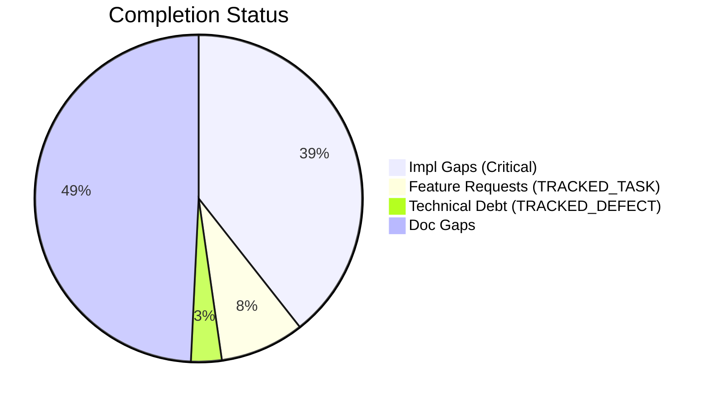
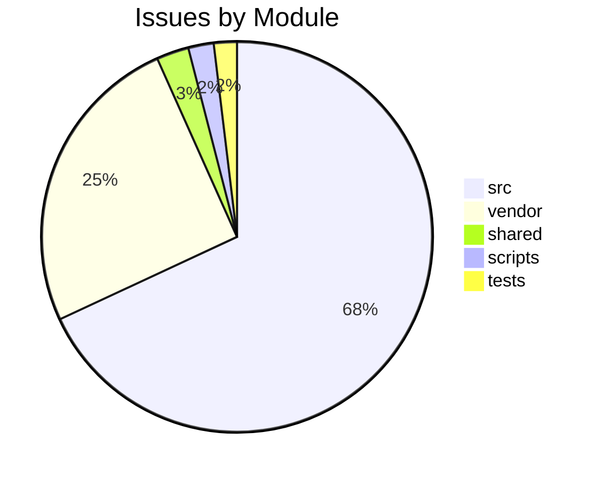

# Completist Report: 2026-03-13

## Executive Summary

- **Critical Gaps**: 416
- **Feature Gaps (TRACKED_TASK)**: 88
- **Technical Debt**: 32
- **Documentation Gaps**: 520

## Visualization

### Status Overview

### Top Impacted Modules

## Critical Incomplete (Top 50)

| File                                                                          | Line | Type | Impact | Coverage | Complexity |
| ----------------------------------------------------------------------------- | ---- | ---- | ------ | -------- | ---------- |
| `./src/api/auth/security.py`                                                  | 315  | Stub | 5      | 2        | 4          |
| `./src/shared/python/physics/topography.py`                                   | 92   | Stub | 5      | 3        | 4          |
| `./src/shared/python/physics/topography.py`                                   | 103  | Stub | 5      | 3        | 4          |
| `./src/shared/python/physics/topography.py`                                   | 115  | Stub | 5      | 3        | 4          |
| `./src/shared/python/physics/terrain_mixin.py`                                | 35   | Stub | 5      | 3        | 4          |
| `./src/shared/python/physics/flexible_shaft.py`                               | 297  | Stub | 5      | 3        | 4          |
| `./src/shared/python/physics/flexible_shaft.py`                               | 301  | Stub | 5      | 3        | 4          |
| `./src/shared/python/physics/flexible_shaft.py`                               | 305  | Stub | 5      | 3        | 4          |
| `./src/shared/python/physics/flexible_shaft.py`                               | 314  | Stub | 5      | 3        | 4          |
| `./src/shared/python/physics/flexible_shaft.py`                               | 342  | Stub | 5      | 3        | 4          |
| `./src/shared/python/physics/flight_models.py`                                | 160  | Stub | 5      | 3        | 4          |
| `./src/shared/python/physics/flight_models.py`                                | 166  | Stub | 5      | 3        | 4          |
| `./src/shared/python/physics/flight_models.py`                                | 172  | Stub | 5      | 3        | 4          |
| `./src/shared/python/physics/flight_models.py`                                | 177  | Stub | 5      | 3        | 4          |
| `./src/shared/python/physics/terrain_engine.py`                               | 43   | Stub | 5      | 3        | 4          |
| `./src/shared/python/physics/impact_model.py`                                 | 144  | Stub | 5      | 3        | 4          |
| `./src/shared/python/model_generation/plugins/__init__.py`                    | 21   | Stub | 5      | 3        | 4          |
| `./src/shared/python/model_generation/plugins/__init__.py`                    | 27   | Stub | 5      | 3        | 4          |
| `./src/shared/python/model_generation/plugins/__init__.py`                    | 32   | Stub | 5      | 3        | 4          |
| `./src/shared/python/model_generation/plugins/__init__.py`                    | 36   | Stub | 5      | 3        | 4          |
| `./src/shared/python/model_generation/library/repository.py`                  | 44   | Stub | 5      | 3        | 4          |
| `./src/shared/python/model_generation/library/repository.py`                  | 50   | Stub | 5      | 3        | 4          |
| `./src/shared/python/model_generation/library/repository.py`                  | 55   | Stub | 5      | 3        | 4          |
| `./src/shared/python/model_generation/library/repository.py`                  | 60   | Stub | 5      | 3        | 4          |
| `./src/shared/python/model_generation/editor/editor_clipboard.py`             | 41   | Stub | 5      | 3        | 4          |
| `./src/shared/python/model_generation/editor/editor_modifications.py`         | 49   | Stub | 5      | 3        | 4          |
| `./src/shared/python/model_generation/editor/editor_modifications.py`         | 51   | Stub | 5      | 3        | 4          |
| `./src/shared/python/model_generation/editor/editor_modifications.py`         | 53   | Stub | 5      | 3        | 4          |
| `./src/shared/python/model_generation/editor/editor_modifications.py`         | 55   | Stub | 5      | 3        | 4          |
| `./src/shared/python/model_generation/builders/base_builder.py`               | 184  | Stub | 5      | 3        | 4          |
| `./src/shared/python/model_generation/builders/base_builder.py`               | 194  | Stub | 5      | 3        | 4          |
| `./src/shared/python/humanoid_character_builder/generators/mesh_generator.py` | 89   | Stub | 5      | 3        | 4          |
| `./src/shared/python/humanoid_character_builder/generators/mesh_generator.py` | 95   | Stub | 5      | 3        | 4          |
| `./src/shared/python/humanoid_character_builder/generators/mesh_generator.py` | 100  | Stub | 5      | 3        | 4          |
| `./src/shared/python/humanoid_character_builder/generators/mesh_generator.py` | 120  | Stub | 5      | 3        | 4          |
| `./src/shared/python/pose_estimation/interface.py`                            | 24   | Stub | 5      | 3        | 4          |
| `./src/shared/python/pose_estimation/interface.py`                            | 32   | Stub | 5      | 3        | 4          |
| `./src/shared/python/pose_estimation/interface.py`                            | 43   | Stub | 5      | 3        | 4          |
| `./src/shared/python/plot_engine/protocols.py`                                | 29   | Stub | 5      | 3        | 4          |
| `./src/shared/python/plot_engine/protocols.py`                                | 33   | Stub | 5      | 3        | 4          |
| `./src/shared/python/plot_engine/protocols.py`                                | 45   | Stub | 5      | 3        | 4          |
| `./src/shared/python/plot_engine/protocols.py`                                | 58   | Stub | 5      | 3        | 4          |
| `./src/shared/python/plot_engine/protocols.py`                                | 62   | Stub | 5      | 3        | 4          |
| `./src/shared/python/calc_backend/protocols.py`                               | 35   | Stub | 5      | 3        | 4          |
| `./src/shared/python/calc_backend/protocols.py`                               | 48   | Stub | 5      | 3        | 4          |
| `./src/shared/python/calc_backend/protocols.py`                               | 61   | Stub | 5      | 3        | 4          |
| `./src/shared/python/calc_backend/protocols.py`                               | 65   | Stub | 5      | 3        | 4          |
| `./src/shared/python/engine_core/sub_protocols.py`                            | 56   | Stub | 5      | 3        | 4          |
| `./src/shared/python/engine_core/sub_protocols.py`                            | 69   | Stub | 5      | 3        | 4          |
| `./src/shared/python/engine_core/sub_protocols.py`                            | 91   | Stub | 5      | 3        | 4          |

## Feature Gap Matrix
