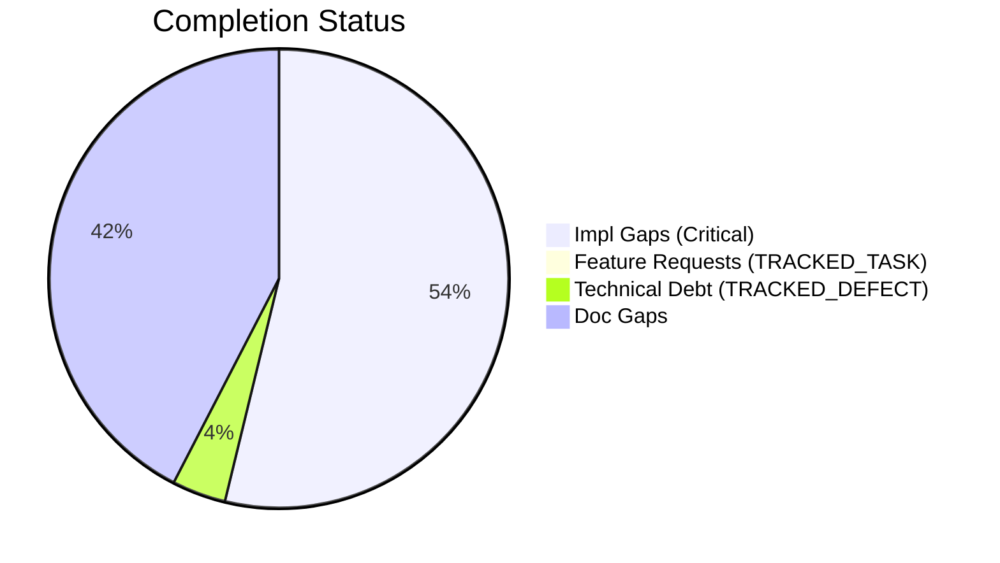
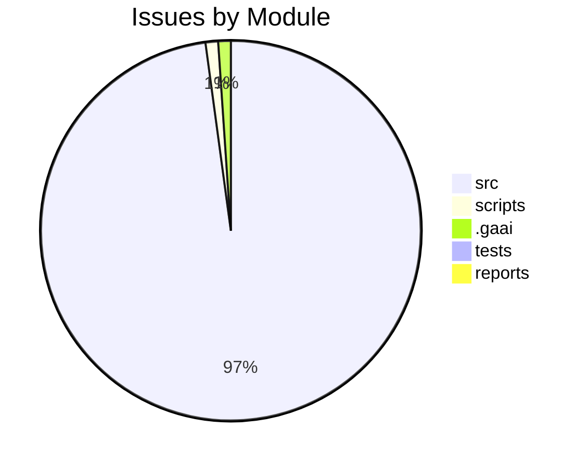

# Completist Report: 2026-03-28

## Executive Summary

- **Critical Gaps**: 355
- **Feature Gaps (TRACKED_TASK)**: 0
- **Technical Debt**: 25
- **Documentation Gaps**: 280

## Visualization

### Status Overview

### Top Impacted Modules

## Critical Incomplete (Top 50)

| File                                                                  | Line | Type | Impact | Coverage | Complexity |
| --------------------------------------------------------------------- | ---- | ---- | ------ | -------- | ---------- |
| `./src/api/auth/security.py`                                          | 337  | Stub | 5      | 2        | 4          |
| `./src/shared/python/physics/topography.py`                           | 96   | Stub | 5      | 3        | 4          |
| `./src/shared/python/physics/topography.py`                           | 107  | Stub | 5      | 3        | 4          |
| `./src/shared/python/physics/topography.py`                           | 119  | Stub | 5      | 3        | 4          |
| `./src/shared/python/physics/terrain_mixin.py`                        | 35   | Stub | 5      | 3        | 4          |
| `./src/shared/python/physics/flexible_shaft.py`                       | 322  | Stub | 5      | 3        | 4          |
| `./src/shared/python/physics/flexible_shaft.py`                       | 326  | Stub | 5      | 3        | 4          |
| `./src/shared/python/physics/flexible_shaft.py`                       | 330  | Stub | 5      | 3        | 4          |
| `./src/shared/python/physics/flexible_shaft.py`                       | 339  | Stub | 5      | 3        | 4          |
| `./src/shared/python/physics/flexible_shaft.py`                       | 371  | Stub | 5      | 3        | 4          |
| `./src/shared/python/physics/flight_models.py`                        | 164  | Stub | 5      | 3        | 4          |
| `./src/shared/python/physics/flight_models.py`                        | 170  | Stub | 5      | 3        | 4          |
| `./src/shared/python/physics/flight_models.py`                        | 176  | Stub | 5      | 3        | 4          |
| `./src/shared/python/physics/flight_models.py`                        | 181  | Stub | 5      | 3        | 4          |
| `./src/shared/python/physics/terrain_engine.py`                       | 47   | Stub | 5      | 3        | 4          |
| `./src/shared/python/physics/impact_model.py`                         | 139  | Stub | 5      | 3        | 4          |
| `./src/shared/python/pendulum_simulator/cross_engine_perturbation.py` | 52   | Stub | 5      | 3        | 4          |
| `./src/shared/python/pendulum_simulator/cross_engine_perturbation.py` | 56   | Stub | 5      | 3        | 4          |
| `./src/shared/python/pendulum_simulator/cross_engine_perturbation.py` | 60   | Stub | 5      | 3        | 4          |
| `./src/shared/python/pendulum_simulator/cross_engine_perturbation.py` | 64   | Stub | 5      | 3        | 4          |
| `./src/shared/python/pendulum_simulator/perturbation_analysis.py`     | 34   | Stub | 5      | 3        | 4          |
| `./src/shared/python/pendulum_simulator/perturbation_analysis.py`     | 40   | Stub | 5      | 3        | 4          |
| `./src/shared/python/pendulum_simulator/gui/controls_widget_base.py`  | 418  | Stub | 5      | 3        | 4          |
| `./src/shared/python/pendulum_simulator/gui/controls_widget_base.py`  | 428  | Stub | 5      | 3        | 4          |
| `./src/shared/python/pendulum_simulator/gui/controls_widget_base.py`  | 438  | Stub | 5      | 3        | 4          |
| `./src/shared/python/pendulum_simulator/gui/controls_widget_base.py`  | 448  | Stub | 5      | 3        | 4          |
| `./src/shared/python/pendulum_simulator/gui/controls_widget_base.py`  | 479  | Stub | 5      | 3        | 4          |
| `./src/shared/python/pendulum_simulator/gui/simulation_panel.py`      | 89   | Stub | 5      | 3        | 4          |
| `./src/shared/python/pendulum_simulator/gui/simulation_panel.py`      | 90   | Stub | 5      | 3        | 4          |
| `./src/shared/python/pendulum_simulator/gui/simulation_panel.py`      | 91   | Stub | 5      | 3        | 4          |
| `./src/shared/python/pendulum_simulator/gui/matrix_widget_base.py`    | 148  | Stub | 5      | 3        | 4          |
| `./src/shared/python/pendulum_simulator/gui/matrix_widget_base.py`    | 158  | Stub | 5      | 3        | 4          |
| `./src/shared/python/pendulum_simulator/gui/matrix_widget_base.py`    | 173  | Stub | 5      | 3        | 4          |
| `./src/shared/python/pendulum_simulator/gui/matrix_widget_base.py`    | 183  | Stub | 5      | 3        | 4          |
| `./src/shared/python/pendulum_simulator/gui/base_pendulum_widget.py`  | 115  | Stub | 5      | 3        | 4          |
| `./src/shared/python/pendulum_simulator/gui/base_pendulum_widget.py`  | 120  | Stub | 5      | 3        | 4          |
| `./src/shared/python/pendulum_simulator/gui/base_pendulum_widget.py`  | 125  | Stub | 5      | 3        | 4          |
| `./src/shared/python/pendulum_simulator/gui/base_pendulum_widget.py`  | 130  | Stub | 5      | 3        | 4          |
| `./src/shared/python/pendulum_simulator/gui/base_pendulum_widget.py`  | 135  | Stub | 5      | 3        | 4          |
| `./src/shared/python/model_generation/plugins/__init__.py`            | 21   | Stub | 5      | 3        | 4          |
| `./src/shared/python/model_generation/plugins/__init__.py`            | 27   | Stub | 5      | 3        | 4          |
| `./src/shared/python/model_generation/plugins/__init__.py`            | 32   | Stub | 5      | 3        | 4          |
| `./src/shared/python/model_generation/plugins/__init__.py`            | 36   | Stub | 5      | 3        | 4          |
| `./src/shared/python/model_generation/library/repository.py`          | 44   | Stub | 5      | 3        | 4          |
| `./src/shared/python/model_generation/library/repository.py`          | 50   | Stub | 5      | 3        | 4          |
| `./src/shared/python/model_generation/library/repository.py`          | 55   | Stub | 5      | 3        | 4          |
| `./src/shared/python/model_generation/library/repository.py`          | 60   | Stub | 5      | 3        | 4          |
| `./src/shared/python/model_generation/editor/editor_clipboard.py`     | 41   | Stub | 5      | 3        | 4          |
| `./src/shared/python/model_generation/editor/editor_modifications.py` | 53   | Stub | 5      | 3        | 4          |
| `./src/shared/python/model_generation/editor/editor_modifications.py` | 55   | Stub | 5      | 3        | 4          |

## Feature Gap Matrix

| Module | Feature Gap | Type |
| ------ | ----------- | ---- |

## Technical Debt Register

| File                                                                               | Line | Issue                                                                                                | Type |
| ---------------------------------------------------------------------------------- | ---- | ---------------------------------------------------------------------------------------------------- | ---- |
| `./src/api/utils/error_codes.py`                                                   | 53   | # General Errors (GMS-GEN-XXX)                                                                       | XXX  |
| `./src/api/utils/error_codes.py`                                                   | 59   | # Engine Errors (GMS-ENG-XXX)                                                                        | XXX  |
| `./src/api/utils/error_codes.py`                                                   | 67   | # Simulation Errors (GMS-SIM-XXX)                                                                    | XXX  |
| `./src/api/utils/error_codes.py`                                                   | 76   | # Video Errors (GMS-VID-XXX)                                                                         | XXX  |
| `./src/api/utils/error_codes.py`                                                   | 83   | # Analysis Errors (GMS-ANL-XXX)                                                                      | XXX  |
| `./src/api/utils/error_codes.py`                                                   | 88   | # Auth Errors (GMS-AUT-XXX)                                                                          | XXX  |
| `./src/api/utils/error_codes.py`                                                   | 95   | # Validation Errors (GMS-VAL-XXX)                                                                    | XXX  |
| `./src/api/utils/error_codes.py`                                                   | 101  | # Resource Errors (GMS-RES-XXX)                                                                      | XXX  |
| `./src/api/utils/error_codes.py`                                                   | 106  | # System Errors (GMS-SYS-XXX)                                                                        | XXX  |
| `./src/shared/models/opensim/opensim-models/Tutorials/doc/styles/site.css`         | 3404 | html body { /_ HACK: Temporary fix for CONF-15412 _/                                                 | HACK |
| `./src/engines/pendulum_models/tools/matlab_utilities/README.md`                   | 261  | - TRACKED_TASK, TRACKED_DEFECT, HACK, XXX placeholders                                               | XXX  |
| `./src/engines/physics_engines/drake/tools/matlab_utilities/README.md`             | 261  | - TRACKED_TASK, TRACKED_DEFECT, HACK, XXX placeholders                                               | XXX  |
| `./src/engines/physics_engines/pinocchio/tools/matlab_utilities/README.md`         | 261  | - TRACKED_TASK, TRACKED_DEFECT, HACK, XXX placeholders                                               | XXX  |
| `./src/engines/Simscape_Multibody_Models/3D_Golf_Model/matlab_utilities/README.md` | 261  | - TRACKED_TASK, TRACKED_DEFECT, HACK, XXX placeholders                                               | XXX  |
| `./src/tools/matlab_utilities/scripts/matlab_quality_check.py`                     | 89   | (r"\bHACK\b", "HACK comment found"),                                                                 | HACK |
| `./src/tools/matlab_utilities/scripts/matlab_quality_check.py`                     | 90   | (r"\bXXX\b", "XXX comment found"),                                                                   | XXX  |
| `./shared/models/opensim/opensim-models/Tutorials/doc/styles/site.css`             | 3404 | html body { /_ HACK: Temporary fix for CONF-15412 _/                                                 | HACK |
| `./scripts/refresh_completist_data.py`                                             | 60   | "TRACKED_TASK\|TRACKED_DEFECT\|XXX\|HACK\|TEMP",                                                     | XXX  |
| `./.gaai/core/skills/cross/friction-retrospective/SKILL.md`                        | 58   | - `signal: high` → automatic promotion candidate (CAND-XXX)                                          | XXX  |
| `./.gaai/core/skills/cross/friction-retrospective/SKILL.md`                        | 64   | - **High-Signal Events (CAND-XXX):** each candidate with evidence, proposed promotion target, and re | XXX  |
| `./.gaai/core/skills/cross/friction-retrospective/SKILL.md`                        | 91   | - Promotion candidates (CAND-XXX) with evidence and recommended targets                              | XXX  |
| `./.gaai/core/skills/cross/friction-retrospective/SKILL.md`                        | 98   | - Every CAND-XXX has at least 2 supporting evidence entries (or 1 with `signal: high`)               | XXX  |
| `./tests/unit/api/test_error_codes.py`                                             | 36   | """Postcondition: All codes follow GMS-XXX-NNN format."""                                            | XXX  |
| `./tests/unit/utils/test_error_codes.py`                                           | 39   | """Every error code must follow GMS-XXX-NNN pattern."""                                              | XXX  |
| `./tests/unit/utils/test_error_codes.py`                                           | 42   | assert len(parts) == 3, f"{code.name} doesn't follow GMS-XXX-NNN"                                    | XXX  |

## Recommended Implementation Order

Prioritized by Impact (High) and Complexity (Low).
| Priority | File | Issue | Metrics (I/C/C) |
|---|---|---|---|
| 1 | `./src/api/auth/security.py` | **init** | 5/2/4 |
| 2 | `./src/shared/python/physics/topography.py` | get_elevation_at | 5/3/4 |
| 3 | `./src/shared/python/physics/topography.py` | get_gradient_at | 5/3/4 |
| 4 | `./src/shared/python/physics/topography.py` | bounds | 5/3/4 |
| 5 | `./src/shared/python/physics/terrain_mixin.py` | get_position | 5/3/4 |
| 6 | `./src/shared/python/physics/flexible_shaft.py` | initialize | 5/3/4 |
| 7 | `./src/shared/python/physics/flexible_shaft.py` | get_state | 5/3/4 |
| 8 | `./src/shared/python/physics/flexible_shaft.py` | apply_load | 5/3/4 |
| 9 | `./src/shared/python/physics/flexible_shaft.py` | step | 5/3/4 |
| 10 | `./src/shared/python/physics/flexible_shaft.py` | apply_load | 5/3/4 |
| 11 | `./src/shared/python/physics/flight_models.py` | name | 5/3/4 |
| 12 | `./src/shared/python/physics/flight_models.py` | description | 5/3/4 |
| 13 | `./src/shared/python/physics/flight_models.py` | reference | 5/3/4 |
| 14 | `./src/shared/python/physics/flight_models.py` | simulate | 5/3/4 |
| 15 | `./src/shared/python/physics/terrain_engine.py` | set_ground_properties | 5/3/4 |
| 16 | `./src/shared/python/physics/impact_model.py` | solve | 5/3/4 |
| 17 | `./src/shared/python/pendulum_simulator/cross_engine_perturbation.py` | reset | 5/3/4 |
| 18 | `./src/shared/python/pendulum_simulator/cross_engine_perturbation.py` | set_control | 5/3/4 |
| 19 | `./src/shared/python/pendulum_simulator/cross_engine_perturbation.py` | step | 5/3/4 |
| 20 | `./src/shared/python/pendulum_simulator/cross_engine_perturbation.py` | get_state | 5/3/4 |

## Issues Created

- Created `docs/assessments/issues/Issue_2244_Incomplete_Stub_in_security_py_337.md`
- Created `docs/assessments/issues/Issue_2195_Incomplete_Stub_in_topography_py_96.md`
- Created `docs/assessments/issues/Issue_2196_Incomplete_Stub_in_topography_py_107.md`
- Created `docs/assessments/issues/Issue_2197_Incomplete_Stub_in_topography_py_119.md`
- Created `docs/assessments/issues/Issue_2031_Incomplete_Stub_in_terrain_mixin_py_35.md`
- Created `docs/assessments/issues/Issue_2150_Incomplete_Stub_in_flexible_shaft_py_322.md`
- Created `docs/assessments/issues/Issue_2151_Incomplete_Stub_in_flexible_shaft_py_326.md`
- Created `docs/assessments/issues/Issue_2251_Incomplete_Stub_in_flexible_shaft_py_330.md`
- Created `docs/assessments/issues/Issue_2252_Incomplete_Stub_in_flexible_shaft_py_339.md`
- Created `docs/assessments/issues/Issue_2253_Incomplete_Stub_in_flexible_shaft_py_371.md`
- Created `docs/assessments/issues/Issue_2204_Incomplete_Stub_in_flight_models_py_164.md`
- Created `docs/assessments/issues/Issue_2205_Incomplete_Stub_in_flight_models_py_170.md`
- Created `docs/assessments/issues/Issue_2206_Incomplete_Stub_in_flight_models_py_176.md`
- Created `docs/assessments/issues/Issue_2207_Incomplete_Stub_in_flight_models_py_181.md`
- Created `docs/assessments/issues/Issue_2208_Incomplete_Stub_in_terrain_engine_py_47.md`
- Created `docs/assessments/issues/Issue_2209_Incomplete_Stub_in_impact_model_py_139.md`
- Created `docs/assessments/issues/Issue_2210_Incomplete_Stub_in_cross_engine_perturbation_py_52.md`
- Created `docs/assessments/issues/Issue_2211_Incomplete_Stub_in_cross_engine_perturbation_py_56.md`
- Created `docs/assessments/issues/Issue_2212_Incomplete_Stub_in_cross_engine_perturbation_py_60.md`
- Created `docs/assessments/issues/Issue_2213_Incomplete_Stub_in_cross_engine_perturbation_py_64.md`
- Created `docs/assessments/issues/Issue_2214_Incomplete_Stub_in_perturbation_analysis_py_34.md`
- Created `docs/assessments/issues/Issue_2215_Incomplete_Stub_in_perturbation_analysis_py_40.md`
- Created `docs/assessments/issues/Issue_2045_Incomplete_Stub_in_controls_widget_base_py_418.md`
- Created `docs/assessments/issues/Issue_2046_Incomplete_Stub_in_controls_widget_base_py_428.md`
- Created `docs/assessments/issues/Issue_2047_Incomplete_Stub_in_controls_widget_base_py_438.md`
- Created `docs/assessments/issues/Issue_2048_Incomplete_Stub_in_controls_widget_base_py_448.md`
- Created `docs/assessments/issues/Issue_2049_Incomplete_Stub_in_controls_widget_base_py_479.md`
- Created `docs/assessments/issues/Issue_2271_Incomplete_Stub_in_simulation_panel_py_89.md`
- Created `docs/assessments/issues/Issue_2272_Incomplete_Stub_in_simulation_panel_py_90.md`
- Created `docs/assessments/issues/Issue_2273_Incomplete_Stub_in_simulation_panel_py_91.md`
- Created `docs/assessments/issues/Issue_2221_Incomplete_Stub_in_matrix_widget_base_py_148.md`
- Created `docs/assessments/issues/Issue_2222_Incomplete_Stub_in_matrix_widget_base_py_158.md`
- Created `docs/assessments/issues/Issue_2223_Incomplete_Stub_in_matrix_widget_base_py_173.md`
- Created `docs/assessments/issues/Issue_2224_Incomplete_Stub_in_matrix_widget_base_py_183.md`
- Created `docs/assessments/issues/Issue_2225_Incomplete_Stub_in_base_pendulum_widget_py_115.md`
- Created `docs/assessments/issues/Issue_2226_Incomplete_Stub_in_base_pendulum_widget_py_120.md`
- Created `docs/assessments/issues/Issue_2227_Incomplete_Stub_in_base_pendulum_widget_py_125.md`
- Created `docs/assessments/issues/Issue_2228_Incomplete_Stub_in_base_pendulum_widget_py_130.md`
- Created `docs/assessments/issues/Issue_2229_Incomplete_Stub_in_base_pendulum_widget_py_135.md`
- Created `docs/assessments/issues/Issue_2062_Incomplete_Stub_in___init___py_21.md`
- Created `docs/assessments/issues/Issue_2063_Incomplete_Stub_in___init___py_27.md`
- Created `docs/assessments/issues/Issue_2064_Incomplete_Stub_in___init___py_32.md`
- Created `docs/assessments/issues/Issue_2065_Incomplete_Stub_in___init___py_36.md`
- Created `docs/assessments/issues/Issue_2066_Incomplete_Stub_in_repository_py_44.md`
- Created `docs/assessments/issues/Issue_2067_Incomplete_Stub_in_repository_py_50.md`
- Created `docs/assessments/issues/Issue_2068_Incomplete_Stub_in_repository_py_55.md`
- Created `docs/assessments/issues/Issue_2069_Incomplete_Stub_in_repository_py_60.md`
- Created `docs/assessments/issues/Issue_2070_Incomplete_Stub_in_editor_clipboard_py_41.md`
- Created `docs/assessments/issues/Issue_2073_Incomplete_Stub_in_editor_modifications_py_53.md`
- Created `docs/assessments/issues/Issue_2074_Incomplete_Stub_in_editor_modifications_py_55.md`
